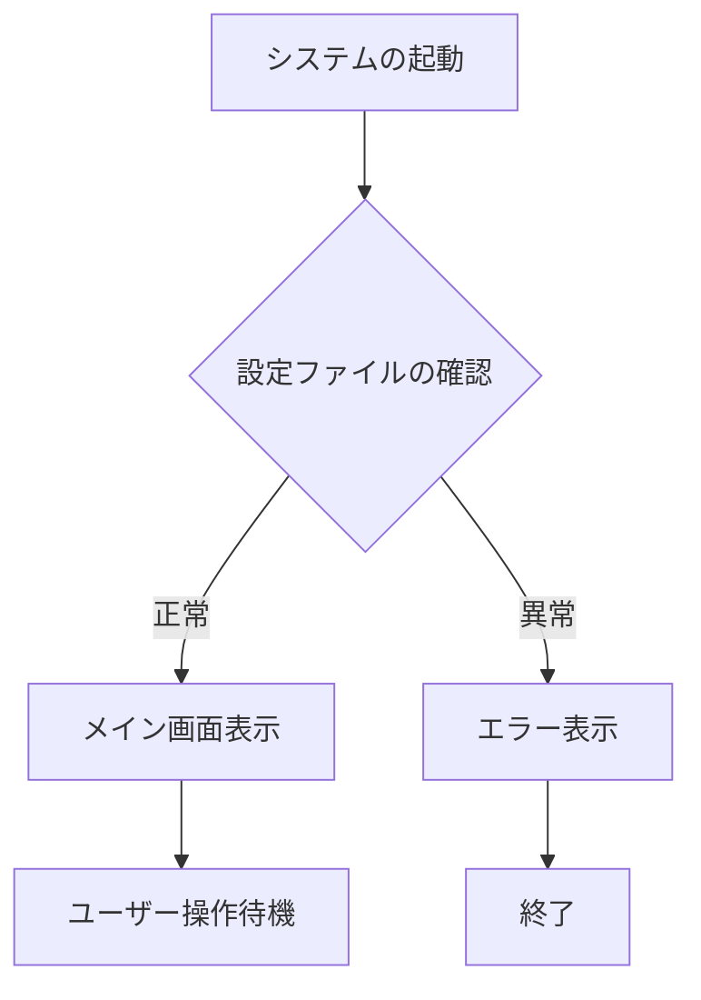

::: center
::: large
ChainFlowWriter
機能ショーケース・マニュアル
:::
:::

ChainFlowWriterは、標準的なMarkdown記法に加え、報告書やマニュアル作成に便利な**専用の拡張機能**をいくつか備えています。このファイルは、それらの機能を一覧できるサンプルです。

## 1. 基本的なテキスト装飾
レポート作成において、文字の強調や打ち消しは不可欠です。

* **太字（Bold）** : `**テキスト**` と書くと **強調** されます。
* *斜体（Italic）* : `*テキスト*` と書きます。
* ~~打ち消し線~~ : `~~テキスト~~` と書くと取り消し線が引かれます。
* インラインコード : 文章中に `コード片段` を埋め込めます。

## 2. 箇条書きとチェックリスト

情報を整理する際は、リスト記法が活用できます。

### 箇条書き
- 項目A
- 項目B
  - 項目B-1 (インデント付き)
  - 項目B-2

### 番号付きリスト
1. 手順1
2. 手順2
3. 手順3

### チェックリスト (Tasklists)
- [x] 完了したタスク
- [ ] 未完了のタスク
- [ ] 選択状態の保存もサポートしています

## 3. 引用とブロック
他の資料からの引用や、補足説明エリアとして使えます。

> これは引用ブロックです。
> 複数行にまたがる文章をグループ化し、左側にラインを引いて強調します。
> 背景色はつかず、シンプルな装飾となっています。


## 4. 表（テーブル）の表現と配置
複雑なデータも、パイプ（`||`）を使って簡単に表組み可能です。
「Table Style」プロパティを **Clean** に設定すると、以下のような美しい成績表のような見た目になります。

| 成分名 | CAS番号 | 含有量 | 備考 |
| :--- | :---: | :---: | ---: |
| エタノール | 64-17-5 | 50% | 第一種有機溶剤 |
| 水 | 7732-18-5 | 40% | |
| 香料 | - | < 10% | 企業秘密 |

※ ヘッダーの区切り文字 (`:---` など) を使うことで、列ごとに **「左揃え」「中央揃え」「右揃え」** を自由に制御できます。


## 5. 配置のコントロール（専用拡張）
ツールバーのボタンから挿入できる独自の配置タグを使えば、文字や画像のレイアウトを自在に操れます。

::: right
これは **「右寄せ (Right Text)」** ブロックの中のテキストです。
署名などをページ右下に配置したい時に適しています。
:::

::: center
これは **「中央揃え (Center Text)」** ブロックの中のテキストです。
:::


## 6. 大きな文字・小さな文字（専用拡張）
見出し（#）とは別に、単なる文字サイズの大小を表現したい場合に重宝します。

::: large
**「Large Text」ボタン**で挿入されるブロックです。
タイトルページや、特に強調したい注意書きなどに最適です。
:::

::: small
**「Small Text」ボタン**で挿入されるブロックです。
ページ下部の脚注や、特記事項の補足など、目立たせたくない長文に向いています。
:::


## 7. 画像のサイズ指定機能
画像をドラッグ＆ドロップすると生成されるHTMLタグの `style` 属性を直接編集することで、画像のサイズをパーセントやピクセルで自由に指定できます。もちろんA4サイズからはみ出すことはありません。

::: center


*↑中央揃え（::: center）と幅60%（style="width: 60%;"）の組み合わせ例*
:::


## 8. 高度なHTMLスニペットの挿入
エディタ上部の **「Insert HTML ▾」** メニューから、Markdownでは表現が難しい便利なHTML構造をワンクリックで挿入できます。

### 2段組みレイアウト (Flex Multi-Col)
左右で情報を比較したり、写真を並べたいときに非常に便利です。

<div style="display: flex; gap: 20px;">
  <div style="flex: 1; min-width: 0;">
    **【左カラム】** <br>
    ここは左側のコンテンツです。Flexboxを使ってレイアウトされているため、ウィンドウや用紙の幅に応じて自動で均等に割り付けられます。
  </div>
  <div style="flex: 1; min-width: 0;">
    **【右カラム】** <br>
    ここは右側のコンテンツです。例えば片方に画像、もう片方にその説明文を配置するといった高度なページ構成が可能になります。
  </div>
</div>
<div style="clear: both;"></div>

### 一部だけ文字色を変える (Red Span)
Markdownには文字色を変える記法がありませんが、HTMLを使えば <span style="color: #d32f2f; font-weight: bold;">このように赤文字</span> などを文中に混ぜることも簡単にできます。

### PDF出力時の強制改頁 (Page Break)
「ここからは絶対に次のページから始めたい」という箇所に `ページ区切り` を挿入します。
編集中は線や隙間は見えませんが、PDF出力エンジンがそれを検知して自動でページを割ってくれます。


## 9. 構造化された補足情報（アドモニション）
単なる引用（>）とは別に、背景色と罫線で「情報」や「警告」を際立たせる専用ブロックです。これらもエディタ上部の「Insert HTML ▾」からワンクリックで挿入できます。

::: info
**【情報】** これは補足説明用のブロックです。背景に淡い青色を敷くことで、本文との差別化を図ります。重要な前提条件や参考リンクなどを書くのに適しています。
:::

::: warning
**【注意】** ここに入力した内容は、読み手に注意を促すための重要なメッセージとして処理されます。手順における危険な操作や、絶対に守ってほしい禁止事項を強調するために用意されています。
:::


## 10. プログラミングコードの挿入
等幅フォント（コンソール向けフォント）と背景色を用いて、ソースコードやコマンドラインの入出力を綺麗に表示します。バッククォート3つ（\```）で囲むだけです。

```python
def hello_world():
    # ChainFlowWriterはコードブロックを自動で整形します
    print("Hello, ChainFlowWriter!")
```


## 11. 脚注（Footnotes）の活用
文章の途中で詳細な注釈を入れたい場合、文末にまとめて表示する注釈機能が標準で使えます。
「この一文には注釈があります[^1]。」のように記述し、文書のどこかに `[^1]: 注釈の内容` と書くだけで、自動でリンクと区切り線付きの脚注リストが生成されます。専門用語の解説などに非常に便利です。

[^1]: このように、設定項目の詳細や用語の定義などは脚注として分離することで、本筋の文章が非常に読みやすくなります。リンクをクリックすると元の場所に戻ります。


## 12. 印刷制御（Advanced Print Control）
PDF出力（印刷）を見据えた、マニュアル作成者垂涎の機能です。

::: no-print
**【印刷非表示ブロック】**
この「no-print」ブロック内のテキストや画像は、こちらの**エディタ画面上（LIVE PREVIEW）では見えますが、PDF出力時には自動的に完全に削除されます。**
執筆者向けの「ここは後で図を差し替えること」「要確認事項」といったメモエリアとして非常に強力に機能します。
:::

## 13. 数式表現（LaTeXサポート）
技術文書や研究報告書に欠かせない数式を、MathJaxを用いて美しくレンダリングします。
`$$` で囲むことでブロック数式になります。

$$
x = \frac{-b \pm \sqrt{b^2 - 4ac}}{2a}
$$

また、文章の中に `$E = mc^2$` のように書くことで、インライン数式も表現可能です。


## 14. 図解とフローチャート（Mermaid.js連携）
画像を用意しなくても、テキストだけで複雑な図が描けます。`mermaid` コードブロックを使用します。



---

*※ この他にもご提案いただいた「目次自動生成（TOC）」「日付入力マクロ（@today）」などの効率化機能につきましても、現在順次開発を進めております！*
