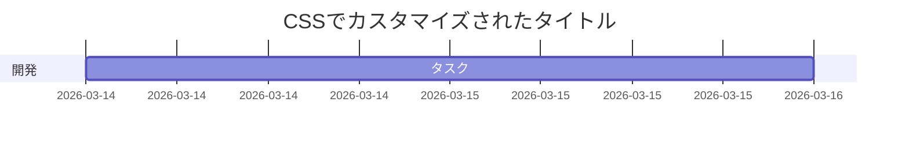

# v4 表現能力：実践文例集 (New Edition)

このドキュメントでは、「書き方（ソースコード）」と「実際の表示結果」をセットで紹介します。
※ 黒いブロックの中に表示されているのがソースコードです。その下のデザインされた部分が実行結果です。

---

## 1. HTMLレイアウト × Markdown (<m-d>タグ)
標準の `<div>` や `<table>` の中でも、Markdown のリストや装飾が自在に使えます。

### 1.1 カード型レイアウト
**書き方（ソース）:**
```html
<div style="padding: 20px; border: 2px solid #4bbaff; border-radius: 12px; background: #f0faff;">
  <m-d>
  ### ここは HTML の内部です
  - **変数もOK**: プロジェクト名「{{project_name}}」
  - [Googleへのリンク](https://google.com)
  - *斜体* や ~~打ち消し~~ も動作します
  </m-d>
</div>
```

**実際の表示:**
<div style="padding: 20px; border: 2px solid #4bbaff; border-radius: 12px; background: #f0faff;">
  <m-d>
  ### ここは HTML の内部です
  - **変数もOK**: プロジェクト名「{{project_name}}」
  - [Googleへのリンク](https://google.com)
  - *斜体* や ~~打ち消し~~ も動作します
  </m-d>
</div>

---

### 1.2 セル内のリスト表示 (Complex Table)
**書き方（ソース）:**
```html
<table style="width: 100%; border-collapse: collapse;">
  <tr style="background: #eee;">
    <th style="border: 1px solid #ccc; padding: 10px;">項目</th>
    <th style="border: 1px solid #ccc; padding: 10px;">Markdown 内容</th>
  </tr>
  <tr>
    <td style="border: 1px solid #ccc; padding: 10px;">進捗状況</td>
    <td style="border: 1px solid #ccc; padding: 10px;">
      <m-d>
      - [x] 基本実装
      - [ ] **高度なテスト**
      </m-d>
    </td>
  </tr>
</table>
```

**実際の表示:**
<table style="width: 100%; border-collapse: collapse;">
  <tr style="background: #eee;">
    <th style="border: 1px solid #ccc; padding: 10px;">項目</th>
    <th style="border: 1px solid #ccc; padding: 10px;">Markdown 内容</th>
  </tr>
  <tr>
    <td style="border: 1px solid #ccc; padding: 10px;">進捗状況</td>
    <td style="border: 1px solid #ccc; padding: 10px;">
      <m-d>
      - [x] 基本実装
      - [ ] **高度なテスト**
      </m-d>
    </td>
  </tr>
</table>

---

## 2. Mermaid 図解 × CSS装飾

### 2.1 CSSでタイトルを目立たせる
**書き方（ソース）:**
※ `<style>` と ` ```mermaid ` の間に**空行を入れない**のがコツです！

```html
<style>
  .mermaid svg .titleText { font-weight: bold; fill: #ff4757 !important; font-size: 22px !important; }
</style>
```mermaid
gantt
    title CSSでカスタマイズされたタイトル
    dateFormat  YYYY-MM-DD
    section 開発
    タスク   :a1, 2d
```
```

**実際の表示:**
<style>.mermaid svg .titleText { font-weight: bold; fill: #ff4757 !important; font-size: 22px !important; }</style>


---

## 3. 数式 (LaTeX)
**書き方:**
```markdown
$$
\mathbf{F} = m\mathbf{a} \quad (\text{現在の値: } \mathbf{ {{result}} })
$$
```

**実際の表示:**
$$
\mathbf{F} = m\mathbf{a} \quad (\text{現在の値: } \mathbf{ 120.5 } )
$$

---

## 4. カスタマイズ：コードブロックの背景色

このドキュメント全体のコードブロック（黒い部分）の色は、冒頭の `---` で囲まれた部分（フロントマター）で自由に変更できます。

**書き方（フロントマターに追記）:**
```yaml
code_bg: "#3e4451"  /* One Dark風の落ち着いた青グレー */
```

または、事務書類に合わせて少し明るくしたい場合は：
```yaml
code_bg: "#f8f8f8"  /* 非常に明るいグレー（文字色も自動で調整されます） */
```
※ 文字色は現在白系固定ですが、背景色を明るくしすぎると見えづらくなるため、基本的には「濃いめの色」を推奨します。
