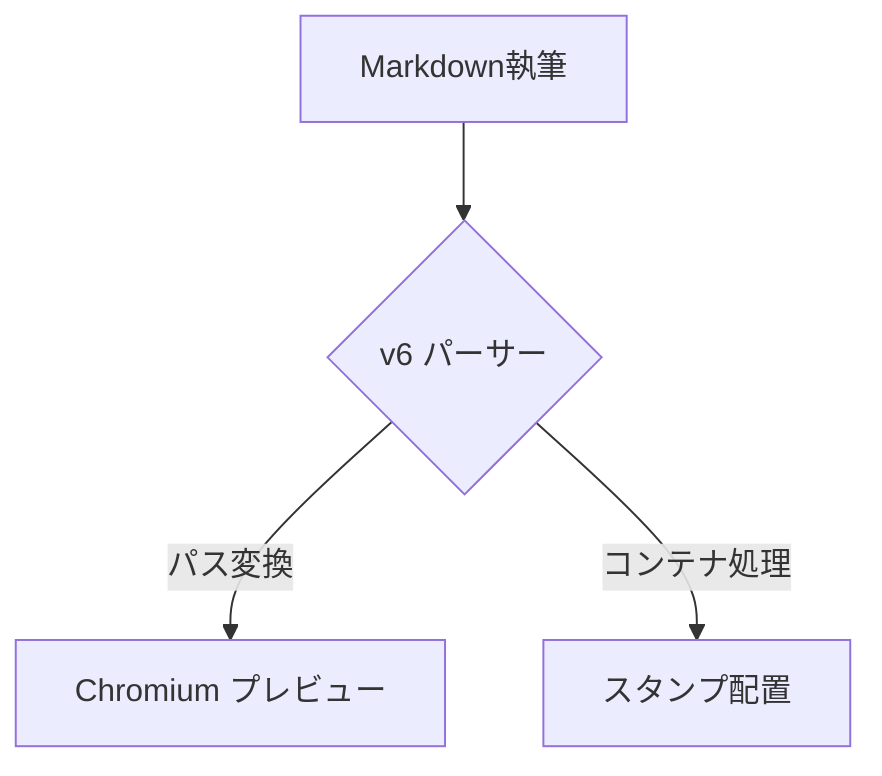

# 🚀 ChainFlow Writer v6 統合テスト用ドキュメント

このドキュメントは、v6で実装された新機能（パス自動解決など）と、既存のMarkdown/HTMLレンダリング、数式、図表などが正常に動作するかを網羅するためのテスト用ファイルです。

## 1. 【新機能】スタンプ & パス自動解決テスト
v6の目玉機能である、Windowsパスと相対パスの自動正規化をテストします。

::: stamp width:15mm;

:::
> **[Check 1]** 右上に絶対パス指定の画像が **15mm幅** で表示されていますか？（リンク切れなし）

::: stamp right:10mm; margin-top:10mm; width:20mm;

:::
> **[Check 2]** その少し下に **20mm幅** の相対パス画像（seal.png）が表示されていますか？

---

## 2. 魔法のタグ `<m-d>` テスト
HTMLの中にMarkdownをネストできる魔法のタグを確認します。

<div style="background: #fdf6e3; padding: 20px; border-radius: 8px; border: 1px solid #eee;">
<m-d>
### 魔法のタグ内部
- リストのレンダリング
- **太字** や *斜体*
- `code line`
</m-d>
</div>

---

## 3. 数式 (KaTeX) & ダイアグラム (Mermaid)
エンジニアリング用途のコンポーネントが正常か確認します。

### インライン数式とブロック数式
ピタゴラスの定理： $a^2 + b^2 = c^2$

$$
e^{i\pi} + 1 = 0
$$

### Mermaid図表


---

## 4. 既存コンテナ & レイアウト
`::: info` や `::: columns` 等。

::: info
**v6 Update:** この情報ブロックは `::: info` で生成されています。
:::

::: warning
**重要:** PDF書き出し前には、プロパティパネルで最終チェックを行ってください。
:::

<div style="display: flex; gap: 20px;">
<div style="flex: 1;">

### 左カラム
マークダウンでの記述が
可能です。

</div>
<div style="flex: 1;">

### 右カラム
- 項目 A
- 項目 B

</div>
</div>

---

## 5. コードブロック & シンタックスハイライト
フロントマターの `code_bg` 設定が反映されているか確認します。

```python
def v6_feature_test():
    path = r"C:\Users\T03000\Desktop\rect1.png"
    # 自動変換されるはず
    print(f"Normalizing path: {path}")
    return True
```

---

## 6. 改ページ制御テスト
PDF時にここから次のページに飛ぶかを確認します。

<div style="page-break-before: always;"></div>

### ここは2ページ目のはずです
プレビュー上で青い点線（ガイド）が表示され、ここがページ先頭付近にあれば正常です。

---

## 7. 特殊文字 & エスケープ
円マークとバックスラッシュの挙動。

- 円マーク: ¥
- 全角円マーク: ￥
- バックスラッシュ: \
- 数式内の円マーク: $\sum_{i=1}^{n} x_i$ (内部で `\sum` に置換される)

---

## 8. テーブルテスト
| 機能名 | 状況 | 備考 |
|:---|:---:|:---|
| Path解決 | ✅ | v6 新規 |
| Stamp | ✅ | CSS改善済み |
| KaTeX | ✅ | ブロック/インライン両方 |
| PDF | ✅ | PageBreak同期 |

