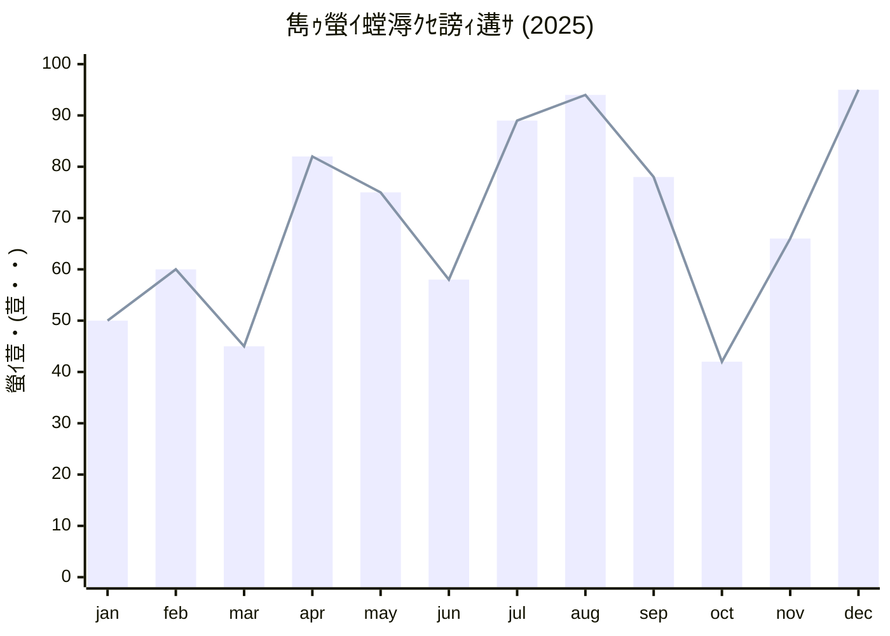

# ChainFlow Writer v7 完全統合ガイドブック ✍️
## 「Typora以上、DTP未満」の極致：プロダクティブ・デザイン執筆環境

---

## 1. 概要 (Overview)
**ChainFlow Writer** は、執筆体験をデザインの領域へと昇華させた「DTP志向」の Markdown エディタです。従来の Markdown 環境では到達できなかった高度なレイアウト制御と、1:1 の PDF 再現性を実現し、事務報告書や技術マニュアルの作成を極限まで効率化します。

ChainFlow Writer v7 は、「書く」から「PDFとして完成させる」までのワークフローを極限まで効率化するために設計された、プロフェッショナル向け Markdown エディタです。最新の Web テクノロジー（Mermaid v11, KaTeX v0.16）と、高精度な物理レンダリングエンジンを融合させ、プレビューと出力結果の完全な一致（1:1 同期）を実現しました。

---

## 2. コア・コンセプト / Core Concepts
## ✨ コア・コンセプト / Core Concepts

### 1. Real-time Page Engine
編集画面に「印刷境界線」をリアルタイム表示。物理的な A4/B5 サイズを正確かつシームレスに再現し、執筆しながら最終的な PDF の出来栄えを確認可能です。

### 2. 1:1 PDF Fidelity (Professional Grade)
Native Qt Print Engine と独自の同期システムにより、プレビューと寸分違わぬ **1:1 の PDF 出力** を実現。改ページ位置のズレや余白の不一致に悩まされることはありません。v7 ではマージン相殺防止ロジックにより、さらに堅牢なレイアウトを保ちます。

### 3. "Magic" Tag: `<m-d>` (Markdown in HTML)
HTML の柔軟なレイアウト能力と Markdown の執筆速度を融合させる独自タグです。
- **HTMLネスト対応**: `<div>` やテーブルセルなどの内部で Markdown を直接記述可能。
- **自動デデント (Auto-Dedent)**: HTML のインデントに合わせて Markdown が深くなっても、レンダリング時に左端の余白を自動で除去。パースエラーを防ぎ、美しいコード構造を維持できます。

### 4. Stamp Syntax (Absolute Positioning)
`::: stamp` 構文により、印影や「社外秘」などの画像を自由な座標に配置。標準の **乗算 (Multiply)** ブレンドにより、紙に押したようなリアルな質感を再現します。

---

## 3. v7 の主要な進化点
## 🚀 v7 の主要な進化点

### 1. フル・フィディリティ・プレビュー完全同期
画面上のプレビューと PDF 出力結果の「1:1 同期」をフル・フィディリティ方式で実現。
- **物理マージンの制約を排除**: PDF 出力時に物理的なマージンを 0 に設定することで、紙の端（0,0 座標）まで描画領域を解放。
- **CSS による論理マージン制御**: プロパティパネルで設定した余白は CSS で精密にエミュレートされるため、すべてのページで寸分違わぬレイアウトが保持されます。
- **改ページ制御の高度化**: ゴースト要素を出さないクリーンな改ページと、マージン相殺（Margin Collapsing）を防止する独自のレンダリングロジックを搭載。改ページ直後の見出しも適切な位置から開始されます。

### 2. インテリジェント・パス解決
Windows の絶対パスや相対パスを、エディタがリアルタイムでブラウザ形式に自動変換。
- 画像リンクに `file:///` などの接頭辞を手動で書く必要はありません。
- `C:\Users\...` のようなパスを貼り付けるだけで、プレビューと PDF の両方で即座に画像が表示されます。

### 3. 特別な配置・強調 (Custom Containers)
標準 Markdown では不可能なレイアウトを、シンプルな記法 `::: ... :::` で実現。
- **配置**: `center` (中央), `right` (右寄せ)
- **サイズ**: `large` (拡大), `small` (縮小)
- **強調**: `info` (情報ボックス), `warning` (警告ボックス)
- **スタンプ (`stamp`)**: ロゴや印影を絶対座標で配置。
    - **マージン領域への食い込み (Bleed)**: フル・フィディリティ方式により、スタンプを余白エリアに配置しても切り取られません（右端 5mm などに配置可能）。
    - `::: stamp right:15mm; margin-top:-10mm; width:20mm;` のように CSS 直接指定が可能。
    - 標準で「乗算 (multiply)」ブレンドがかかり、印影が紙に馴染みます。

### 4. 魔法のタグ `<m-d>` (Markdown-in-HTML)
HTML の柔軟なレイアウト機能と、Markdown の書きやすさを融合。
- `<div style="..."> <m-d> ... </m-d> </div>` のように記述することで、複雑な HTML 構造の内部に直接 Markdown をネストして記述できます。

---

## 4. 特別な配置・強調タグ (Custom Containers & <m-d>)
### 配置とスタイル
### 3. 特別な配置・強調 (Custom Containers)
標準 Markdown では不可能なレイアウトを、シンプルな記法 `::: ... :::` で実現。
- **配置**: `center` (中央), `right` (右寄せ)
- **サイズ**: `large` (拡大), `small` (縮小)
- **強調**: `info` (情報ボックス), `warning` (警告ボックス)
- **スタンプ (`stamp`)**: ロゴや印影を絶対座標で配置。
    - **マージン領域への食い込み (Bleed)**: フル・フィディリティ方式により、スタンプを余白エリアに配置しても切り取られません（右端 5mm などに配置可能）。
    - `::: stamp right:15mm; margin-top:-10mm; width:20mm;` のように CSS 直接指定が可能。
    - 標準で「乗算 (multiply)」ブレンドがかかり、印影が紙に馴染みます。

### 魔法のタグ `<m-d>`
### 4. 魔法のタグ `<m-d>` (Markdown-in-HTML)
HTML の柔軟なレイアウト機能と、Markdown の書きやすさを融合。
- `<div style="..."> <m-d> ... </m-d> </div>` のように記述することで、複雑な HTML 構造の内部に直接 Markdown をネストして記述できます。
※ HTML の内部で Markdown を記述できる強力な機能です。オートデデント機能により、コードの美しさを保ったままネストが可能です。

---

## 5. 高度な表現 (Mermaid & KaTeX)
## 🛠 高度なコンテンツ表現

### 📈 ダイアグラム (Mermaid v11)
最新の Mermaid v11 エンジンを搭載。
- フローチャート、シーケンス図、ガントチャート、マインドマップ等を ESM モジュールとして高速レンダリング。
- ` ```mermaid ` ブロック内に記述するだけで、プロフェッショナルな図解が完成します。

### 📐 数式レンダリング (KaTeX)
物理学や数学のレポートに不可欠な高品質な数式表示。
- ブロック数式: `$$ ... $$`
- インライン数式: `$ ... $`
- 円マーク（￥）とバックスラッシュ（\）の自動正規化により、日本語キーボードでもストレスなく入力可能。

---

## 6. 実践ガイド：レイアウトと装飾のサンプル (Sample Gallery)
::: center
::: large
**ChainFlowWriter v7**
讖溯・繧ｷ繝ｧ繝ｼ繧ｱ繝ｼ繧ｹ繝ｻ繝槭ル繝･繧｢繝ｫ
:::
:::

ChainFlowWriter縺ｯ縲∵ｨ呎ｺ也噪縺ｪMarkdown險俶ｳ輔↓蜉縺医€∝ｱ蜻頑嶌繧・・繝九Η繧｢繝ｫ菴懈・縺ｫ萓ｿ蛻ｩ縺ｪ**蟆ら畑縺ｮ諡｡蠑ｵ讖溯・**繧偵＞縺上▽縺句ｙ縺医※縺・∪縺吶€ゅ％縺ｮ繝輔ぃ繧､繝ｫ縺ｯ縲√◎繧後ｉ縺ｮ讖溯・繧剃ｸ€隕ｧ縺ｧ縺阪ｋ繧ｵ繝ｳ繝励Ν縺ｧ縺吶€・
## 1. 蝓ｺ譛ｬ逧・↑繝・く繧ｹ繝郁｣・｣ｾ
繝ｬ繝昴・繝井ｽ懈・縺ｫ縺翫＞縺ｦ縲∵枚蟄励・蠑ｷ隱ｿ繧・遠縺｡豸医＠縺ｯ荳榊庄谺縺ｧ縺吶€・
* **螟ｪ蟄暦ｼ・old・・* : `**繝・く繧ｹ繝・*` 縺ｨ譖ｸ縺上→ **蠑ｷ隱ｿ** 縺輔ｌ縺ｾ縺吶€・* *譁應ｽ難ｼ・talic・・ : `*繝・く繧ｹ繝・` 縺ｨ譖ｸ縺阪∪縺吶€・* ~~謇薙■豸医＠邱嘸~ : `~~繝・く繧ｹ繝・~` 縺ｨ譖ｸ縺上→蜿悶ｊ豸医＠邱壹′蠑輔°繧後∪縺吶€・* 繧､繝ｳ繝ｩ繧､繝ｳ繧ｳ繝ｼ繝・: 譁・ｫ荳ｭ縺ｫ `繧ｳ繝ｼ繝臥援谿ｵ` 繧貞沂繧∬ｾｼ繧√∪縺吶€・
## 2. 邂・擅譖ｸ縺阪→繝√ぉ繝・け繝ｪ繧ｹ繝・
諠・ｱ繧呈紛逅・☆繧矩圀縺ｯ縲√Μ繧ｹ繝郁ｨ俶ｳ輔′豢ｻ逕ｨ縺ｧ縺阪∪縺吶€・
### 邂・擅譖ｸ縺・- 鬆・岼A
- 鬆・岼B
  - 鬆・岼B-1 (繧､繝ｳ繝・Φ繝井ｻ倥″)
  - 鬆・岼B-2

### 逡ｪ蜿ｷ莉倥″繝ｪ繧ｹ繝・1. 謇矩・
2. 謇矩・
3. 謇矩・

### 繝√ぉ繝・け繝ｪ繧ｹ繝・(Tasklists)
- [x] 螳御ｺ・＠縺溘ち繧ｹ繧ｯ
- [ ] 譛ｪ螳御ｺ・・繧ｿ繧ｹ繧ｯ
- [ ] 驕ｸ謚樒憾諷九・菫晏ｭ倥ｂ繧ｵ繝昴・繝医＠縺ｦ縺・∪縺・
## 3. 蠑慕畑縺ｨ繝悶Ο繝・け
莉悶・雉・侭縺九ｉ縺ｮ蠑慕畑繧・€∬｣懆ｶｳ隱ｬ譏弱お繝ｪ繧｢縺ｨ縺励※菴ｿ縺医∪縺吶€・
> 縺薙ｌ縺ｯ蠑慕畑繝悶Ο繝・け縺ｧ縺吶€・> 隍・焚陦後↓縺ｾ縺溘′繧区枚遶繧偵げ繝ｫ繝ｼ繝怜喧縺励€∝ｷｦ蛛ｴ縺ｫ繝ｩ繧､繝ｳ繧貞ｼ輔＞縺ｦ蠑ｷ隱ｿ縺励∪縺吶€・> 閭梧勹濶ｲ縺ｯ縺､縺九★縲√す繝ｳ繝励Ν縺ｪ陬・｣ｾ縺ｨ縺ｪ縺｣縺ｦ縺・∪縺吶€・

## 4. 陦ｨ・医ユ繝ｼ繝悶Ν・峨・陦ｨ迴ｾ縺ｨ驟咲ｽｮ
隍・尅縺ｪ繝・・繧ｿ繧ゅ€√ヱ繧､繝暦ｼ・|`・峨ｒ菴ｿ縺｣縺ｦ邁｡蜊倥↓陦ｨ邨・∩蜿ｯ閭ｽ縺ｧ縺吶€・縲卦able Style縲阪・繝ｭ繝代ユ繧｣繧・**Clean** 縺ｫ險ｭ螳壹☆繧九→縲∽ｻ･荳九・繧医≧縺ｪ鄒弱＠縺・・邵ｾ陦ｨ縺ｮ繧医≧縺ｪ隕九◆逶ｮ縺ｫ縺ｪ繧翫∪縺吶€・
| 謌仙・蜷・| CAS逡ｪ蜿ｷ | 蜷ｫ譛蛾㍼ | 蛯呵€・|
| :--- | :---: | :---: | ---: |
| 繧ｨ繧ｿ繝弱・繝ｫ | 64-17-5 | 50% | 隨ｬ荳€遞ｮ譛画ｩ滓ｺｶ蜑､ |
| 豌ｴ | 7732-18-5 | 40% | |
| 鬥呎侭 | - | < 10% | 莨∵･ｭ遘伜ｯ・|

窶ｻ 繝倥ャ繝€繝ｼ縺ｮ蛹ｺ蛻・ｊ譁・ｭ・(`:---` 縺ｪ縺ｩ) 繧剃ｽｿ縺・％縺ｨ縺ｧ縲∝・縺斐→縺ｫ **縲悟ｷｦ謠・∴縲阪€御ｸｭ螟ｮ謠・∴縲阪€悟承謠・∴縲・* 繧定・逕ｱ縺ｫ蛻ｶ蠕｡縺ｧ縺阪∪縺吶€・

## 5. 驟咲ｽｮ縺ｮ繧ｳ繝ｳ繝医Ο繝ｼ繝ｫ・亥ｰら畑諡｡蠑ｵ・・繝・・繝ｫ繝舌・縺ｮ繝懊ち繝ｳ縺九ｉ謖ｿ蜈･縺ｧ縺阪ｋ迢ｬ閾ｪ縺ｮ驟咲ｽｮ繧ｿ繧ｰ繧剃ｽｿ縺医・縲∵枚蟄励ｄ逕ｻ蜒上・繝ｬ繧､繧｢繧ｦ繝医ｒ閾ｪ蝨ｨ縺ｫ謫阪ｌ縺ｾ縺吶€・
::: right
縺薙ｌ縺ｯ **縲悟承蟇・○ (Right Text)縲・* 繝悶Ο繝・け縺ｮ荳ｭ縺ｮ繝・く繧ｹ繝医〒縺吶€・鄂ｲ蜷阪↑縺ｩ繧偵・繝ｼ繧ｸ蜿ｳ荳九↓驟咲ｽｮ縺励◆縺・凾縺ｫ驕ｩ縺励※縺・∪縺吶€・:::

::: center
縺薙ｌ縺ｯ **縲御ｸｭ螟ｮ謠・∴ (Center Text)縲・* 繝悶Ο繝・け縺ｮ荳ｭ縺ｮ繝・く繧ｹ繝医〒縺吶€・:::


## 6. 螟ｧ縺阪↑譁・ｭ励・蟆上＆縺ｪ譁・ｭ暦ｼ亥ｰら畑諡｡蠑ｵ・・隕句・縺暦ｼ・・峨→縺ｯ蛻･縺ｫ縲∝腰縺ｪ繧区枚蟄励し繧､繧ｺ縺ｮ螟ｧ蟆上ｒ陦ｨ迴ｾ縺励◆縺・ｴ蜷医↓驥榊ｮ昴＠縺ｾ縺吶€・
::: large
**縲鍬arge Text縲阪・繧ｿ繝ｳ**縺ｧ謖ｿ蜈･縺輔ｌ繧九ヶ繝ｭ繝・け縺ｧ縺吶€・繧ｿ繧､繝医Ν繝壹・繧ｸ繧・€∫音縺ｫ蠑ｷ隱ｿ縺励◆縺・ｳｨ諢乗嶌縺阪↑縺ｩ縺ｫ譛€驕ｩ縺ｧ縺吶€・:::

::: small
**縲郡mall Text縲阪・繧ｿ繝ｳ**縺ｧ謖ｿ蜈･縺輔ｌ繧九ヶ繝ｭ繝・け縺ｧ縺吶€・繝壹・繧ｸ荳矩Κ縺ｮ閼壽ｳｨ繧・€∫音險倅ｺ矩・・陬懆ｶｳ縺ｪ縺ｩ縲∫岼遶九◆縺帙◆縺上↑縺・聞譁・↓蜷代＞縺ｦ縺・∪縺吶€・:::


## 7. 逕ｻ蜒上・繧ｵ繧､繧ｺ謖・ｮ壽ｩ溯・
逕ｻ蜒上ｒ繝峨Λ繝・げ・・ラ繝ｭ繝・・縺吶ｋ縺ｨ逕滓・縺輔ｌ繧稀TML繧ｿ繧ｰ縺ｮ `style` 螻樊€ｧ繧堤峩謗･邱ｨ髮・☆繧九％縺ｨ縺ｧ縲∫判蜒上・繧ｵ繧､繧ｺ繧偵ヱ繝ｼ繧ｻ繝ｳ繝医ｄ繝斐け繧ｻ繝ｫ縺ｧ閾ｪ逕ｱ縺ｫ謖・ｮ壹〒縺阪∪縺吶€ゅｂ縺｡繧阪ｓA4繧ｵ繧､繧ｺ縺九ｉ縺ｯ縺ｿ蜃ｺ縺吶％縺ｨ縺ｯ縺ゅｊ縺ｾ縺帙ｓ縲・
::: center


*竊台ｸｭ螟ｮ謠・∴・・:: center・峨→蟷・0%・・tyle="width: 60%;"・峨・邨・∩蜷医ｏ縺帑ｾ・
:::


## 8. 鬮伜ｺｦ縺ｪHTML繧ｹ繝九・繝・ヨ縺ｮ謖ｿ蜈･
繧ｨ繝・ぅ繧ｿ荳企Κ縺ｮ **縲粂TML 笆ｾ縲・* 繝｡繝九Η繝ｼ縺九ｉ縲｀arkdown縺ｧ縺ｯ陦ｨ迴ｾ縺碁屮縺励＞萓ｿ蛻ｩ縺ｪHTML讒矩€繧偵Ρ繝ｳ繧ｯ繝ｪ繝・け縺ｧ謖ｿ蜈･縺ｧ縺阪∪縺吶€・
### 2谿ｵ邨・∩繝ｬ繧､繧｢繧ｦ繝・(Flex Multi-Col)
蟾ｦ蜿ｳ縺ｧ諠・ｱ繧呈ｯ碑ｼ・＠縺溘ｊ縲∝・逵溘ｒ荳ｦ縺ｹ縺溘＞縺ｨ縺阪↓髱槫ｸｸ縺ｫ萓ｿ蛻ｩ縺ｧ縺吶€・
<div style="display: flex; gap: 20px;">
  <div style="flex: 1; min-width: 0;">
    **縲仙ｷｦ繧ｫ繝ｩ繝縲・* <br>
    縺薙％縺ｯ蟾ｦ蛛ｴ縺ｮ繧ｳ繝ｳ繝・Φ繝・〒縺吶€・lexbox繧剃ｽｿ縺｣縺ｦ繝ｬ繧､繧｢繧ｦ繝医＆繧後※縺・ｋ縺溘ａ縲√え繧｣繝ｳ繝峨え繧・畑邏吶・蟷・↓蠢懊§縺ｦ閾ｪ蜍輔〒蝮・ｭ峨↓蜑ｲ繧贋ｻ倥￠繧峨ｌ縺ｾ縺吶€・  </div>
  <div style="flex: 1; min-width: 0;">
    **縲仙承繧ｫ繝ｩ繝縲・* <br>
    縺薙％縺ｯ蜿ｳ蛛ｴ縺ｮ繧ｳ繝ｳ繝・Φ繝・〒縺吶€ゆｾ九∴縺ｰ迚・婿縺ｫ逕ｻ蜒上€√ｂ縺・援譁ｹ縺ｫ縺昴・隱ｬ譏取枚繧帝・鄂ｮ縺吶ｋ縺ｨ縺・▲縺滄ｫ伜ｺｦ縺ｪ繝壹・繧ｸ讒区・縺悟庄閭ｽ縺ｫ縺ｪ繧翫∪縺吶€・  </div>
</div>
<div style="clear: both;"></div>

### 荳€驛ｨ縺縺第枚蟄苓牡繧貞､峨∴繧・(Red Span)
Markdown縺ｫ縺ｯ譁・ｭ苓牡繧貞､峨∴繧玖ｨ俶ｳ輔′縺ゅｊ縺ｾ縺帙ｓ縺後€？TML繧剃ｽｿ縺医・ <span style="color: #d32f2f; font-weight: bold;">縺薙・繧医≧縺ｫ襍､譁・ｭ・/span> 縺ｪ縺ｩ繧呈枚荳ｭ縺ｫ豺ｷ縺懊ｋ縺薙→繧らｰ｡蜊倥↓縺ｧ縺阪∪縺吶€・
### PDF蜃ｺ蜉帶凾縺ｮ蠑ｷ蛻ｶ謾ｹ鬆・(Page Break)
縲後％縺薙°繧峨・邨ｶ蟇ｾ縺ｫ谺｡縺ｮ繝壹・繧ｸ縺九ｉ蟋九ａ縺溘＞縲阪→縺・≧邂・園縺ｫ `繝壹・繧ｸ蛹ｺ蛻・ｊ` 繧呈諺蜈･縺励∪縺吶€・

## 9. 讒矩€蛹悶＆繧後◆陬懆ｶｳ諠・ｱ・医い繝峨Δ繝九す繝ｧ繝ｳ・・蜊倥↑繧句ｼ慕畑・・・峨→縺ｯ蛻･縺ｫ縲∬レ譎ｯ濶ｲ縺ｨ鄂ｫ邱壹〒縲梧ュ蝣ｱ縲阪ｄ縲瑚ｭｦ蜻翫€阪ｒ髫帷ｫ九◆縺帙ｋ蟆ら畑繝悶Ο繝・け縺ｧ縺吶€ゅ％繧後ｉ繧ゅヤ繝ｼ繝ｫ繝舌・縺九ｉ繝ｯ繝ｳ繧ｯ繝ｪ繝・け縺ｧ謖ｿ蜈･縺ｧ縺阪∪縺吶€・
::: info
**縲先ュ蝣ｱ縲・* 縺薙ｌ縺ｯ陬懆ｶｳ隱ｬ譏守畑縺ｮ繝悶Ο繝・け縺ｧ縺吶€りレ譎ｯ縺ｫ豺｡縺・搨濶ｲ繧呈聞縺上％縺ｨ縺ｧ縲∵悽譁・→縺ｮ蟾ｮ蛻･蛹悶ｒ蝗ｳ繧翫∪縺吶€る㍾隕√↑蜑肴署譚｡莉ｶ繧・盾閠・Μ繝ｳ繧ｯ縺ｪ縺ｩ繧呈嶌縺上・縺ｫ驕ｩ縺励※縺・∪縺吶€・:::

::: warning
**縲先ｳｨ諢上€・* 縺薙％縺ｫ蜈･蜉帙＠縺溷・螳ｹ縺ｯ縲∬ｪｭ縺ｿ謇九↓豕ｨ諢上ｒ菫・☆縺溘ａ縺ｮ驥崎ｦ√↑繝｡繝・そ繝ｼ繧ｸ縺ｨ縺励※蜃ｦ逅・＆繧後∪縺吶€よ焔鬆・↓縺翫￠繧句些髯ｺ縺ｪ謫堺ｽ懊ｄ縲∫ｵｶ蟇ｾ縺ｫ螳医▲縺ｦ縺ｻ縺励＞遖∵ｭ｢莠矩・ｒ蠑ｷ隱ｿ縺吶ｋ縺溘ａ縺ｫ逕ｨ諢上＆繧後※縺・∪縺吶€・:::


## 10. 螟画焚蝓九ａ霎ｼ縺ｿ讖溯・・・2譁ｰ讖溯・・・譁・嶌蜀帝ｭ縺ｮ繝輔Ο繝ｳ繝医・繧ｿ繝ｼ・・---` 縺ｧ蝗ｲ縺ｾ繧後◆驛ｨ蛻・ｼ峨〒螳夂ｾｩ縺励◆蛟､繧偵€∵悽譁・ｸｭ縺ｧ `{{螟画焚蜷閤}` 縺ｨ縺励※蜿ら・縺ｧ縺阪∪縺吶€・
- 譁・嶌逡ｪ蜿ｷ: **{{document_id}}**
- 菴懈・諡・ｽ・ **{{author_name}}**

窶ｻ 蜷後§蛟､繧定､・焚縺ｮ邂・園縺ｧ菴ｿ縺・◆縺・ｴ蜷医ｄ縲∵律莉倥ｄ蜷咲ｧｰ繧剃ｸ€諡ｬ縺ｧ螟画峩縺励◆縺・ｴ蜷医↓髱槫ｸｸ縺ｫ蠑ｷ蜉帙〒縺吶€・

## 11. 髮ｻ蟄仙魂蠖ｱ繝ｻ繧ｹ繧ｿ繝ｳ繝玲ｩ溯・・・2譁ｰ讖溯・・・`::: stamp` 繝悶Ο繝・け繧剃ｽｿ逕ｨ縺吶ｋ縺ｨ縲∫樟蝨ｨ縺ｮ譁・ｭ嶺ｽ咲ｽｮ繧定ｵｷ轤ｹ縺ｫ縺励▽縺､縲√・繝ｼ繧ｸ縺ｮ莉ｻ諢上・菴咲ｽｮ・育ｵｶ蟇ｾ蠎ｧ讓呻ｼ峨↓逕ｻ蜒上ｒ驟咲ｽｮ縺ｧ縺阪∪縺吶€・
::: center
::: stamp right:30mm; margin-top:-20mm; transform:rotate(-10deg); opacity:0.8;

:::
*竊代％縺ｮ繧医≧縺ｫ縲∵枚蟄励・荳翫↓驥阪↑繧九€瑚ｪ阪ａ蜊ｰ縲阪ｄ縲檎､ｾ螟也ｧ倥せ繧ｿ繝ｳ繝励€阪ｒ陦ｨ迴ｾ縺ｧ縺阪∪縺吶€・
:::

窶ｻ 讓呎ｺ悶〒縲御ｹ礼ｮ・multiply)縲阪ヶ繝ｬ繝ｳ繝峨′縺九°繧九◆繧√€∽ｸ九・譁・ｭ励ｄ鄂ｫ邱壹ｒ騾城℃縺輔○縲∫ｴ吶↓謚ｼ縺励◆繧医≧縺ｪ繝ｪ繧｢繝ｫ縺ｪ雉ｪ諢溘ｒ蜀咲樟縺励∪縺吶€・

## 12. 繝槭け繝ｭ縺ｨ繝√・繝医す繝ｼ繝・蝓ｷ遲・柑邇・ｒ譛€螟ｧ蛹悶☆繧九◆繧√・繝・・繝ｫ鄒､縺ｧ縺吶€・
- **繝槭け繝ｭ繝｡繝九Η繝ｼ**: 縲御ｻ頑律縺ｮ譌･莉倥€阪ｒ閾ｪ逕ｱ縺ｪ蠖｢蠑擾ｼ・YYY/MM/DD, 2026蟷ｴ3譛・3譌･, 13 March 2026 縺ｪ縺ｩ・峨〒荳€逋ｺ謖ｿ蜈･縺ｧ縺阪∪縺吶€・- **繝√・繝医す繝ｼ繝・(`Ctrl+H`)**: 繧医￥菴ｿ縺・TML讒矩€繧・ｮ壼梛譁・ｒ繧ｮ繝｣繝ｩ繝ｪ繝ｼ蠖｢蠑上〒繝励Ξ繝薙Η繝ｼ縺励↑縺後ｉ謖ｿ蜈･縺ｧ縺阪∪縺吶€り・蛻・ｰら畑縺ｮ繧ｹ繝九・繝・ヨ逋ｻ骭ｲ繧ょ庄閭ｽ縺ｧ縺吶€・

## 13. 謨ｰ蠑剰｡ｨ迴ｾ・・aTeX/MathJax・・謚€陦捺枚譖ｸ繧・皮ｩｶ蝣ｱ蜻頑嶌縺ｫ谺縺九○縺ｪ縺・焚蠑上ｒ鄒弱＠縺上Ξ繝ｳ繝€繝ｪ繝ｳ繧ｰ縺励∪縺吶€・
$$
x = \frac{-b \pm \sqrt{b^2 - 4ac}}{2a}
$$

縺ｾ縺溘€∵枚遶縺ｮ荳ｭ縺ｫ `$E = mc^2$` 縺ｮ繧医≧縺ｫ譖ｸ縺上％縺ｨ縺ｧ縲√う繝ｳ繝ｩ繧､繝ｳ謨ｰ蠑上ｂ陦ｨ迴ｾ蜿ｯ閭ｽ縺ｧ縺吶€・

## 14. 蝗ｳ隗｣縺ｨ繝輔Ο繝ｼ繝√Ε繝ｼ繝茨ｼ・ermaid.js・・繝・く繧ｹ繝医□縺代〒隍・尅縺ｪ蝗ｳ縺梧緒縺代∪縺吶€・
```mermaid
graph TD
    A[繧ｷ繧ｹ繝・Β縺ｮ襍ｷ蜍評 --> B{險ｭ螳壹ヵ繧｡繧､繝ｫ縺ｮ遒ｺ隱閤
    B -- 豁｣蟶ｸ --> C[繝｡繧､繝ｳ逕ｻ髱｢陦ｨ遉ｺ]
    B -- 逡ｰ蟶ｸ --> D[繧ｨ繝ｩ繝ｼ陦ｨ遉ｺ]
    D --> E[邨ゆｺ・
    C --> F[繝ｦ繝ｼ繧ｶ繝ｼ謫堺ｽ懷ｾ・ｩ歉
```


## 15. 繝励Ο繧ｰ繝ｩ繝溘Φ繧ｰ繧ｳ繝ｼ繝峨・謖ｿ蜈･
遲牙ｹ・ヵ繧ｩ繝ｳ繝医→閭梧勹濶ｲ繧堤畑縺・※縲√た繝ｼ繧ｹ繧ｳ繝ｼ繝峨ｒ邯ｺ鮗励↓陦ｨ遉ｺ縺励∪縺吶€・
```python
def hello_world():
    # ChainFlowWriter縺ｯ繧ｳ繝ｼ繝峨ヶ繝ｭ繝・け繧定・蜍輔〒謨ｴ蠖｢縺励∪縺・    print("Hello, ChainFlowWriter v2!")
```


## 16. 閼壽ｳｨ・・ootnotes・・譁・ｫ縺ｮ騾比ｸｭ縺ｧ隧ｳ邏ｰ縺ｪ豕ｨ驥医ｒ蜈･繧後◆縺・ｴ蜷医€∵枚譛ｫ縺ｫ縺ｾ縺ｨ繧√※陦ｨ遉ｺ縺吶ｋ豕ｨ驥域ｩ溯・縺御ｽｿ縺医∪縺兌^1]縲・
[^1]: 縺薙・繧医≧縺ｫ縲∬ｨｭ螳夐・岼縺ｮ隧ｳ邏ｰ繧・畑隱槭・螳夂ｾｩ縺ｪ縺ｩ縺ｯ閼壽ｳｨ縺ｨ縺励※蛻・屬縺吶ｋ縺薙→縺ｧ縲∵悽遲九・譁・ｫ縺碁撼蟶ｸ縺ｫ隱ｭ縺ｿ繧・☆縺上↑繧翫∪縺吶€・

## 17. 蜊ｰ蛻ｷ蛻ｶ蠕｡・・dvanced Print Control・・PDF蜃ｺ蜉幢ｼ亥魂蛻ｷ・峨ｒ隕区紺縺医◆縲√・繝九Η繧｢繝ｫ菴懈・閠・桙豸弱・讖溯・縺ｧ縺吶€・
::: no-print
**縲仙魂蛻ｷ髱櫁｡ｨ遉ｺ繝悶Ο繝・け縲・*
縺薙・縲系o-print縲阪ヶ繝ｭ繝・け蜀・・蜀・ｮｹ縺ｯ縲・*繧ｨ繝・ぅ繧ｿ荳翫〒縺ｯ隕九∴縺ｾ縺吶′縲￣DF蜃ｺ蜉帶凾縺ｫ縺ｯ閾ｪ蜍慕噪縺ｫ螳悟・縺ｫ蜑企勁縺輔ｌ縺ｾ縺吶€・*
蝓ｷ遲・€・髄縺代・繝｡繝｢繧ｨ繝ｪ繧｢縺ｨ縺励※譛€驕ｩ縺ｧ縺吶€・:::


## 18. 繧､繝ｳ繧ｿ繝ｩ繧ｯ繝・ぅ繝悶・繧ｹ繝九・繝・ヨ・医け繝ｪ繝・け縺ｧ繧ｳ繝斐・・・繝励Ξ繝薙Η繝ｼ逕ｻ髱｢荳翫〒縲後け繝ｪ繝・け縺吶ｋ縺縺代〒螳壼梛譁・ｒ繧ｯ繝ｪ繝・・繝懊・繝峨↓繧ｳ繝斐・縲阪〒縺阪ｋ蟾･螟ｫ縺ｧ縺吶€ゅ・繝九Η繧｢繝ｫ繧・€√メ繝ｼ繝縺ｧ蜈ｱ譛峨☆繧九ユ繝ｳ繝励Ξ繝ｼ繝磯寔縺ｮ荳ｭ縺ｫ邨・∩霎ｼ繧€縺ｨ縲∬ｻ｢險倥Α繧ｹ繧偵ぞ繝ｭ縺ｫ縺ｧ縺阪∪縺吶€・
<div style="background: #f9f9f9; border-radius: 8px; padding: 15px; border: 1px solid #eee; margin: 10px 0;">
  <p style="margin-top: 0; font-weight: bold; color: #555; font-size: 0.9em;">燥 莉･荳九・繝懊ち繝ｳ繧偵け繝ｪ繝・け縺励※隧ｦ縺励※縺ｿ縺ｦ縺上□縺輔＞</p>
  
  <span id='copy-btn-1' style='display: inline-block; padding: 6px 14px; background: #ffffff; border: 1px solid #0078d4; border-radius: 6px; color: #0078d4; cursor: pointer; user-select: none; font-weight: bold; font-size: 0.95em; transition: all 0.2s;' 
        onmouseover='this.style.background="#f0f7ff"' 
        onmouseout='this.style.background="#ffffff"'
        onclick="const text = '---\ntitle: 騾ｱ谺｡蝣ｱ蜻頑嶌\ndate: {{today}}\nauthor: {{author_name}}\n---\n\n## 1. 莉企€ｱ縺ｮ謌先棡\n- \n'; navigator.clipboard.writeText(text).then(() => { const oldBody = this.innerHTML; this.innerHTML = '笨・繧ｳ繝斐・縺励∪縺励◆・・; this.style.color = '#28a745'; this.style.borderColor = '#28a745'; setTimeout(() => { this.innerHTML = oldBody; this.style.color = '#0078d4'; this.style.borderColor = '#0078d4'; }, 2000); })">
    搭 蝣ｱ蜻頑嶌繝倥ャ繝€繝ｼ繧偵さ繝斐・
  </span>

  <span id='copy-btn-2' style='display: inline-block; margin-left: 10px; padding: 6px 14px; background: #ffffff; border: 1px solid #0078d4; border-radius: 6px; color: #0078d4; cursor: pointer; user-select: none; font-weight: bold; font-size: 0.95em; transition: all 0.2s;' 
        onmouseover='this.style.background="#f0f7ff"' 
        onmouseout='this.style.background="#ffffff"'
        onclick="const text = '::: info\n**縲先悽譌･縺ｮ縺顔衍繧峨○縲・*\n\n:::'; navigator.clipboard.writeText(text).then(() => { const oldBody = this.innerHTML; this.innerHTML = '笨・繧ｳ繝斐・螳御ｺ・; this.style.color = '#28a745'; this.style.borderColor = '#28a745'; setTimeout(() => { this.innerHTML = oldBody; this.style.color = '#0078d4'; this.style.borderColor = '#0078d4'; }, 2000); })">
    搭 Info繝悶Ο繝・け繧偵さ繝斐・
  </span>
</div>

## 19. 譛€譁ｰ縺ｮ蝗ｳ隗｣讖溯・ (Mermaid v11 譁ｰ讖溯・: XY Chart)
Writer v7 縺ｧ縺ｯ譛€譁ｰ縺ｮ Mermaid v11 繧呈政霈峨€ゅ％繧後∪縺ｧ髮｣縺励°縺｣縺・XY 繧ｰ繝ｩ繝輔↑縺ｩ繧ゅユ繧ｭ繧ｹ繝医□縺代〒險倩ｿｰ蜿ｯ閭ｽ縺ｧ縺吶€・


---

*窶ｻ ChainFlowWriter v7 縺ｧ縺ｯ縲∵怙譁ｰ縺ｮ繝ｩ繧､繝悶Λ繝ｪ・・ermaid v11 / KaTeX v0.16・峨ｒ謳ｭ霈峨＠縲√ｈ繧願｡ｨ迴ｾ縺ｮ蟷・′蠎・′繧翫∪縺励◆縲・

---

## 7. テクニカル検証と統合テスト (Technical Verification)
# 噫 ChainFlow Writer v7 邨ｱ蜷医ユ繧ｹ繝育畑繝峨く繝･繝｡繝ｳ繝・
縺薙・繝峨く繝･繝｡繝ｳ繝医・縲」6縺ｧ螳溯｣・＆繧後◆譁ｰ讖溯・・医ヱ繧ｹ閾ｪ蜍戊ｧ｣豎ｺ縺ｪ縺ｩ・峨→縲∵里蟄倥・Markdown/HTML繝ｬ繝ｳ繝€繝ｪ繝ｳ繧ｰ縲∵焚蠑上€∝峙陦ｨ縺ｪ縺ｩ縺梧ｭ｣蟶ｸ縺ｫ蜍穂ｽ懊☆繧九°繧堤ｶｲ鄒・☆繧九◆繧√・繝・せ繝育畑繝輔ぃ繧､繝ｫ縺ｧ縺吶€・
## 1. 縲先眠讖溯・縲代せ繧ｿ繝ｳ繝・& 繝代せ閾ｪ蜍戊ｧ｣豎ｺ繝・せ繝・v7縺ｮ逶ｮ邇画ｩ溯・縺ｧ縺ゅｋ縲仝indows繝代せ縺ｨ逶ｸ蟇ｾ繝代せ縺ｮ閾ｪ蜍墓ｭ｣隕丞喧繧偵ユ繧ｹ繝医＠縺ｾ縺吶€・
::: stamp width:15mm;

:::
> **[Check 1]** 蜿ｳ荳翫↓邨ｶ蟇ｾ繝代せ謖・ｮ壹・逕ｻ蜒上′ **15mm蟷・* 縺ｧ陦ｨ遉ｺ縺輔ｌ縺ｦ縺・∪縺吶°・滂ｼ医Μ繝ｳ繧ｯ蛻・ｌ縺ｪ縺暦ｼ・
::: stamp right:10mm; margin-top:10mm; width:20mm;

:::
> **[Check 2]** 縺昴・蟆代＠荳九↓ **20mm蟷・* 縺ｮ逶ｸ蟇ｾ繝代せ逕ｻ蜒擾ｼ・eal.png・峨′陦ｨ遉ｺ縺輔ｌ縺ｦ縺・∪縺吶°・・
---

## 2. 鬲疲ｳ輔・繧ｿ繧ｰ `<m-d>` 繝・せ繝・HTML縺ｮ荳ｭ縺ｫMarkdown繧偵ロ繧ｹ繝医〒縺阪ｋ鬲疲ｳ輔・繧ｿ繧ｰ繧堤｢ｺ隱阪＠縺ｾ縺吶€・
<div style="background: #fdf6e3; padding: 20px; border-radius: 8px; border: 1px solid #eee;">
<m-d>
### 鬲疲ｳ輔・繧ｿ繧ｰ蜀・Κ
- 繝ｪ繧ｹ繝医・繝ｬ繝ｳ繝€繝ｪ繝ｳ繧ｰ
- **螟ｪ蟄・* 繧・*譁應ｽ・
- `code line`
</m-d>
</div>

---

## 3. 謨ｰ蠑・(KaTeX) & 繝€繧､繧｢繧ｰ繝ｩ繝 (Mermaid)
繧ｨ繝ｳ繧ｸ繝九い繝ｪ繝ｳ繧ｰ逕ｨ騾斐・繧ｳ繝ｳ繝昴・繝阪Φ繝医′豁｣蟶ｸ縺狗｢ｺ隱阪＠縺ｾ縺吶€・
### 繧､繝ｳ繝ｩ繧､繝ｳ謨ｰ蠑上→繝悶Ο繝・け謨ｰ蠑・繝斐ち繧ｴ繝ｩ繧ｹ縺ｮ螳夂炊・・$a^2 + b^2 = c^2$

$$
e^{i\pi} + 1 = 0
$$

### Mermaid蝗ｳ陦ｨ
```mermaid
graph TD
    A[Markdown蝓ｷ遲・ --> B{v7 繝代・繧ｵ繝ｼ}
    B -->|繝代せ螟画鋤| C[Chromium 繝励Ξ繝薙Η繝ｼ]
    B -->|繧ｳ繝ｳ繝・リ蜃ｦ逅・ D[繧ｹ繧ｿ繝ｳ繝鈴・鄂ｮ]
```

---

## 4. 譌｢蟄倥さ繝ｳ繝・リ & 繝ｬ繧､繧｢繧ｦ繝・`::: info` 繧・`::: columns` 遲峨€・
::: info
**v7 Update:** 縺薙・諠・ｱ繝悶Ο繝・け縺ｯ `::: info` 縺ｧ逕滓・縺輔ｌ縺ｦ縺・∪縺吶€・:::

::: warning
**驥崎ｦ・** PDF譖ｸ縺榊・縺怜燕縺ｫ縺ｯ縲√・繝ｭ繝代ユ繧｣繝代ロ繝ｫ縺ｧ譛€邨ゅメ繧ｧ繝・け繧定｡後▲縺ｦ縺上□縺輔＞縲・:::

<div style="display: flex; gap: 20px;">
<div style="flex: 1;">

### 蟾ｦ繧ｫ繝ｩ繝
繝槭・繧ｯ繝€繧ｦ繝ｳ縺ｧ縺ｮ險倩ｿｰ縺・蜿ｯ閭ｽ縺ｧ縺吶€・
</div>
<div style="flex: 1;">

### 蜿ｳ繧ｫ繝ｩ繝
- 鬆・岼 A
- 鬆・岼 B

</div>
</div>

---

## 5. 繧ｳ繝ｼ繝峨ヶ繝ｭ繝・け & 繧ｷ繝ｳ繧ｿ繝・け繧ｹ繝上う繝ｩ繧､繝・繝輔Ο繝ｳ繝医・繧ｿ繝ｼ縺ｮ `code_bg` 險ｭ螳壹′蜿肴丐縺輔ｌ縺ｦ縺・ｋ縺狗｢ｺ隱阪＠縺ｾ縺吶€・
```python
def v7_feature_test():
    path = r"C:\Users\T03000\Desktop\rect1.png"
    # 閾ｪ蜍募､画鋤縺輔ｌ繧九・縺・    print(f"Normalizing path: {path}")
    return True
```

---

## 6. 謾ｹ繝壹・繧ｸ蛻ｶ蠕｡繝・せ繝・PDF譎ゅ↓縺薙％縺九ｉ谺｡縺ｮ繝壹・繧ｸ縺ｫ鬟帙・縺九ｒ遒ｺ隱阪＠縺ｾ縺吶€・
<div style="page-break-before: always;"></div>

### 縺薙％縺ｯ2繝壹・繧ｸ逶ｮ縺ｮ縺ｯ縺壹〒縺・繝励Ξ繝薙Η繝ｼ荳翫〒髱偵＞轤ｹ邱夲ｼ医ぎ繧､繝会ｼ峨′陦ｨ遉ｺ縺輔ｌ縲√％縺薙′繝壹・繧ｸ蜈磯ｭ莉倩ｿ代↓縺ゅｌ縺ｰ豁｣蟶ｸ縺ｧ縺吶€・
---

## 7. 迚ｹ谿頑枚蟄・& 繧ｨ繧ｹ繧ｱ繝ｼ繝・蜀・・繝ｼ繧ｯ縺ｨ繝舌ャ繧ｯ繧ｹ繝ｩ繝・す繝･縺ｮ謖吝虚縲・
- 蜀・・繝ｼ繧ｯ: ﾂ･
- 蜈ｨ隗貞・繝槭・繧ｯ: ・･
- 繝舌ャ繧ｯ繧ｹ繝ｩ繝・す繝･: \
- 謨ｰ蠑丞・縺ｮ蜀・・繝ｼ繧ｯ: $\sum_{i=1}^{n} x_i$ (蜀・Κ縺ｧ `\sum` 縺ｫ鄂ｮ謠帙＆繧後ｋ)

---

## 8. 繝・・繝悶Ν繝・せ繝・| 讖溯・蜷・| 迥ｶ豕・| 蛯呵€・|
|:---|:---:|:---|
| Path隗｣豎ｺ | 笨・| v7 譁ｰ隕・|
| Stamp | 笨・| CSS謾ｹ蝟・ｸ医∩ |
| KaTeX | 笨・| 繝悶Ο繝・け/繧､繝ｳ繝ｩ繧､繝ｳ荳｡譁ｹ |
| PDF | 笨・| PageBreak蜷梧悄 |

---

## 8. キーボード・ワークフロー (ショートカット一覧)
### 基本および編集ショートカット
## ⌨️ 究極のキーボード・ワークフロー (Total Flow)

v7 ではマウスを握ることなく、すべての操作をキーボードで完結可能です。

### 主要ショートカット一覧

| カテゴリ | コマンド | キー操作 |
| :

### クイックスタート・補助
### 主要ショートカット
| ショートカット | アクション |
| :

---

## 9. プロパティとレイアウト設定 (Property Panel)
## 📋 プロパティ・レイアウト設定
右側の設定ペインで、ドキュメントの「器」を直感的に調整できます。

- **用紙サイズ**: A4 / B5 / Letter（縦・横対応）
- **タイポグラフィ**: フォント（明朝・ゴシック等）、基本サイズ、行間の微調整。
- **枠線設定**: テーブルの枠線有無をワンクリックで切り替え。
- **ページ装飾**: ヘッダー・フッターの個別設定、ページ番号の自動挿入。

---

## 10. インストール・環境設定
### 環境準備
Python 3.12 以上が必要です。

```powershell
# 依存関係のインストール
py -m pip install PySide6 markdown2 pygments python-frontmatter PyYAML
```

### 起動方法
```powershell
py main.py
```

---

## 11. ディレクトリ構成とポータビリティ
## 📁 ディレクトリ構成
- `app/`: アプリケーションのコアロジック（UI, Widget, Utils）
- `snippets_data/`: 登録済みスニペットと設定データの保存場所
- `main.py`: エントリーポイント
- `DOCUMENTATION.md`: 詳細な機能マニュアル（機能の使い方はこちらを参照）

## 📂 ポータビリティと管理
- すべての設定、スニペットデータは `snippets_data` フォルダに集約。
- インストール不要で、フォルダごと持ち運ぶだけでどこでも同じ環境が再現されます。

---

*ChainFlow Writer v7 - 執筆を、もっと美しく、もっと自由に。*
