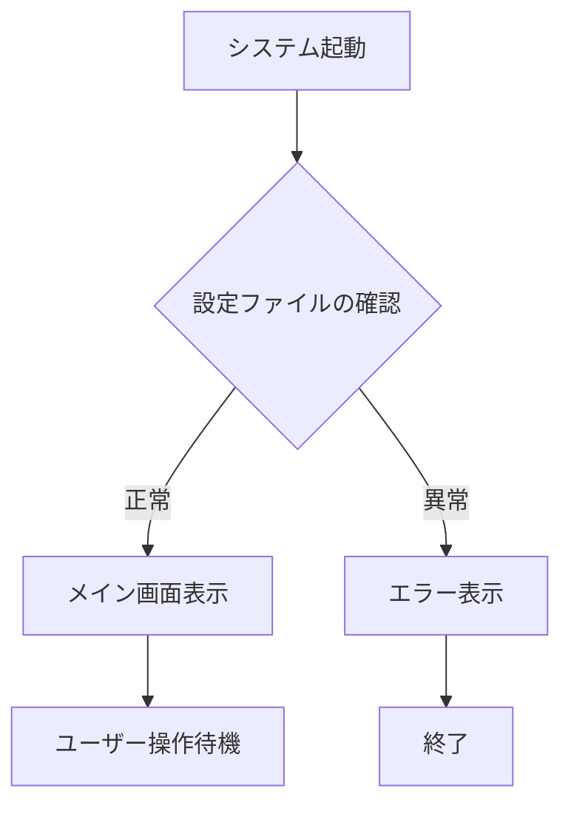
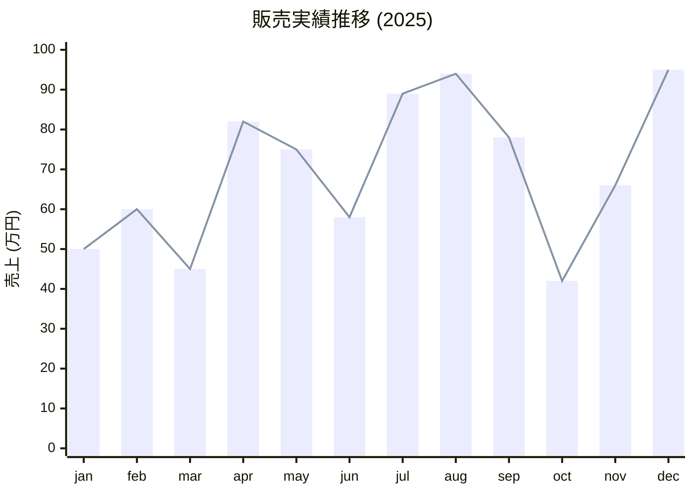
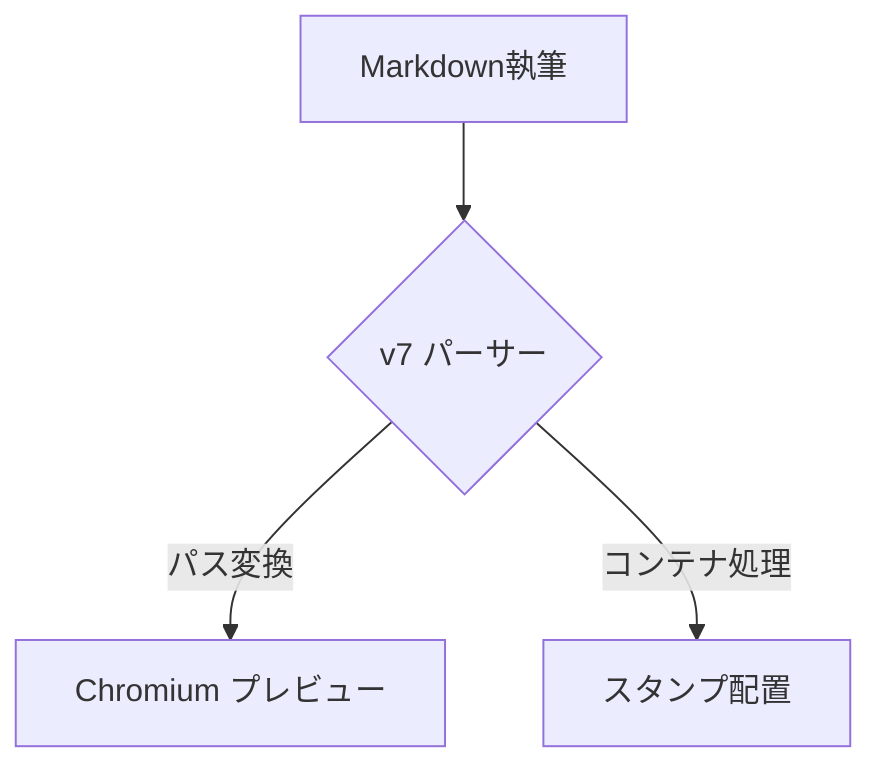

# ChainFlow Writer v7 完全統合ガイドブック ✍️
## 「Typora以上、DTP未満」の極致：プロダクティブ・デザイン執筆環境

---

## 1. 概要 (Overview)
**ChainFlow Writer** は、執筆体験をデザインの領域へと昇華させた「DTP志向」の Markdown エディタです。従来の Markdown 環境では到達できなかった高度なレイアウト制御と、1:1 の PDF 再現性を実現し、事務報告書や技術マニュアルの作成を極限まで効率化します。

ChainFlow Writer v7 は、「書く」から「PDFとして完成させる」までのワークフローを極限まで効率化するために設計された、プロフェッショナル向け Markdown エディタです。最新の Web テクノロジー（Mermaid v11, KaTeX v0.16）と、高精度な物理レンダリングエンジンを融合させ、プレビューと出力結果の完全な一致（1:1 同期）を実現しました。

---

## 2. コア・コンセプト / Core Concepts

### 1. Real-time Page Engine
編集画面に「印刷境界線」をリアルタイム表示。物理的な A4/B5 サイズを正確かつシームレスに再現し、執筆しながら最終的な PDF の出来栄えを確認可能です。

### 2. 1:1 PDF Fidelity (Professional Grade)
Native Qt Print Engine と独自の同期システムにより、プレビューと寸分違わぬ **1:1 の PDF 出力** を実現。改ページ位置のズレや余白の不一致に悩まされることはありません。v7 ではマージン相殺防止ロジックにより、さらに堅牢なレイアウトを保ちます。

### 3. "Magic" Tag: `<m-d>` (Markdown in HTML)
HTML の柔軟なレイアウト能力と Markdown の執筆速度を融合させる独自タグです。
- **HTMLネスト対応**: `<div>` やテーブルセルなどの内部で Markdown を直接記述可能。
- **自動デデント (Auto-Dedent)**: HTML のインデントに合わせて Markdown が深くなっても、レンダリング時に左端の余白を自動で除去。パースエラーを防ぎ、美しいコード構造を維持できます。

### 4. Stamp Syntax (Absolute Positioning)
`::: stamp` 構文により、印影や「社外秘」などの画像を自由な座標に配置。標準の **乗算 (Multiply)** ブレンドにより、紙に押したようなリアルな質感を再現します。

---

## 3. v7 の主要な進化点

### 1. フル・フィディリティ・プレビュー完全同期
画面上のプレビューと PDF 出力結果の「1:1 同期」をフル・フィディリティ方式で実現。
- **物理マージンの制約を排除**: PDF 出力時に物理的なマージンを 0 に設定することで、紙の端（0,0 座標）まで描画領域を解放。
- **CSS による論理マージン制御**: プロパティパネルで設定した余白は CSS で精密にエミュレートされるため、すべてのページで寸分違わぬレイアウトが保持されます。
- **改ページ制御の高度化**: ゴースト要素を出さないクリーンな改ページと、マージン相殺（Margin Collapsing）を防止する独自のレンダリングロジックを搭載。改ページ直後の見出しも適切な位置から開始されます。

### 2. インテリジェント・パス解決
Windows の絶対パスや相対パスを、エディタがリアルタイムでブラウザ形式に自動変換。
- 画像リンクに `file:///` などの接頭辞を手動で書く必要はありません。
- `C:\Users\...` のようなパスを貼り付けるだけで、プレビューと PDF の両方で即座に画像が表示されます。

---

## 4. 特別な配置・強調タグ (Custom Containers & <m-d>)

### 配置とスタイル (Custom Containers)
標準 Markdown では不可能なレイアウトを、シンプルな記法 `::: ... :::` で実現。
- **配置**: `center` (中央), `right` (右寄せ)
- **サイズ**: `large` (拡大), `small` (縮小)
- **強調**: `info` (情報ボックス), `warning` (警告ボックス)
- **スタンプ (`stamp`)**: ロゴや印影を絶対座標で配置。
    - **マージン領域への食い込み (Bleed)**: フル・フィディリティ方式により、スタンプを余白エリアに配置しても切り取られません（右端 5mm などに配置可能）。
    - `::: stamp right:15mm; margin-top:-10mm; width:20mm;` のように CSS 直接指定が可能。
    - 標準で「乗算 (multiply)」ブレンドがかかり、印影が紙に馴染みます。

### 魔法のタグ `<m-d>` (Markdown-in-HTML)
HTML の柔軟なレイアウト機能と、Markdown の書きやすさを融合。
- `<div style="..."> <m-d> ... </m-d> </div>` のように記述することで、複雑な HTML 構造の内部に直接 Markdown をネストして記述できます。
※ HTML の内部で Markdown を記述できる強力な機能です。オートデデント機能により、コードの美しさを保ったままネストが可能です。

---

## 5. 高度な表現 (Mermaid & KaTeX)

### 📈 ダイアグラム (Mermaid v11)
最新の Mermaid v11 エンジンを搭載。
- フローチャート、シーケンス図、ガントチャート、マインドマップ等を ESM モジュールとして高速レンダリング。
- ` ```mermaid ` ブロック内に記述するだけで、プロフェッショナルな図解が完成します。

### 📐 数式レンダリング (KaTeX)
物理学や数学のレポートに不可欠な高品質な数式表示。
- ブロック数式: `$$ ... $$`
- インライン数式: `$ ... $`
- 円マーク（￥）とバックスラッシュ（\）の自動正規化により、日本語キーボードでもストレスなく入力可能。

---

## 6. 実践ガイド：レイアウトと装飾のサンプル (Sample Gallery)
::: center
::: large
**ChainFlowWriter v7**
機能ショーケース・マニュアル
:::
:::

ChainFlowWriterは、標準的なMarkdown記法に加え、報告書やマニュアル作成に便利な**専用の拡張機能**をいくつか備えています。このファイルは、それらの機能を一覧できるサンプルです。

## 1. 基本的なテキスト装飾
レポート作成において、文字の強調や打ち消しは不可欠です。
* **太字 (Bold)** : `**テキスト**` と書くと **強調** されます。
* *斜体 (Italic)* : `*テキスト*` と書きます。
* ~~打ち消し線~~ : `~~テキスト~~` と書くと取り消し線が引かれます。
* インラインコード: 文章中に `コード片段` を埋め込めます。

## 2. 箇条書きとチェックリスト
情報を整理する際は、リスト記法が活用できます。
### 箇条書き
- 項目A
- 項目B
  - 項目B-1 (インデント付き)
  - 項目B-2

### 番号付きリスト
1. 手順1
2. 手順2
3. 手順3

### チェックリスト (Tasklists)
- [x] 完了したタスク
- [ ] 未完了のタスク
- [ ] 選択状態の保存もサポートしています。

## 3. 引用とブロック
他の資料からの引用や、補足説明エリアとして使えます。
> これは引用ブロックです。
> 複数行にまたがる文章をグループ化し、左側にラインを引いて強調します。
> 背景色はつかず、シンプルな装飾となっています。

## 4. 表 (テーブル) の表現と配置
複雑なデータも、パイプ (`|`) を使って簡単に表現可能です。「Table Style」プロパティを **Clean** に設定すると、以下のような美しい実績表のような見た目になります。

| 成分名 | CAS番号 | 含有量 | 備考 |
| :--- | :---: | :---: | ---: |
| エタノール | 64-17-5 | 50% | 第一種有機溶剤 |
| 水 | 7732-18-5 | 40% | |
| 香料 | - | < 10% | 企業秘密 |

※ ヘッダーの区切り文字 (`:---` など) を使うことで、列ごとに **「左揃え」「中央揃え」「右揃え」** を自由に制御できます。

## 5. 配置のコントロール (専用拡張機能)
ツールバーのボタンから挿入できる独自の配置タグを使えば、文字や画像のレイアウトを自在に操れます。

::: right
これは **「右寄せ (Right Text)」** ブロックの中のテキストです。署名などをページ右下に配置したい時に適しています。
:::

::: center
これは **「中央揃え (Center Text)」** ブロックの中のテキストです。
:::

## 6. 大きな文字・小さな文字 (専用拡張機能)
見出し (#) とは別に、単なる文字サイズの大小を表現したい場合に重宝します。

::: large
**「Large Text」ボタン**で挿入されるブロックです。タイトルページや、特に強調したい注意書きなどに最適です。
:::

::: small
**「Small Text」ボタン**で挿入されるブロックです。ページ下部の脚注や、特記事項の補足など、目立たせたくない長文に向いています。
:::


## 7. 画像のサイズ指定機能
画像をドラッグ＆ドロップすると生成されるHTMLタグの `style` 属性を直接編集することで、画像のサイズをパーセントやピクセルで自由に指定できます。もちろんA4サイズからはみ出すことはありません。
::: center


*※ 中央揃え (::: center) と幅 60% (style="width: 60%;") の組み合わせ例*
:::


## 8. 高度なHTMLスニペットの挿入
エディタ上部の **「HTML ▾」** メニューから、Markdownでは表現が難しい便利なHTML構造をワンクリックで挿入できます。
### 2段組みレイアウト (Flex Multi-Col)
左右で情報を比較したり、写真を並べたいときに非常に便利です。
<div style="display: flex; gap: 20px;">
  <div style="flex: 1; min-width: 0;">
    **【左カラム】** <br>
    ここは左側のコンテンツです。Flexboxを使ってレイアウトされているため、ウィンドウや用紙の幅に応じて自動で均等に割り付けられます。
  </div>
  <div style="flex: 1; min-width: 0;">
    **【右カラム】** <br>
    ここは右側のコンテンツです。例えば片方に画像、もう片方にその説明文を配置するといった高度なページ構成が可能になります。
  </div>
</div>
<div style="clear: both;"></div>

### 一部だけ文字色を変える (Red Span)
Markdownには文字色を変える記法がありませんが、HTMLを使えば <span style="color: #d32f2f; font-weight: bold;">このように赤文字</span> などを文中に混ぜることも簡単にできます。
### PDF出力時の強制改ページ (Page Break)
「ここからは絶対に次のページから始めたい」という箇所に `ページ区切り` を挿入します。

## 9. 構造化された補足情報 (アドモニション)
単なる引用 (>) とは別に、背景色と罫線で「情報」や「警告」を際立たせる専用ブロックです。これらもツールバーからワンクリックで挿入できます。
::: info
**【情報】** これは補足説明用のブロックです。背景に淡い色を敷くことで、本文との差別化を図ります。重要な前提条件や参考リンクなどを書くのに適しています。
:::

::: warning
**【注意】** ここに入力した内容は、読み手に注意を促すための重要なメッセージとして処理されます。手順における危険な操作や、絶対に守ってほしい禁止事項を強調するために用意されています。
:::


## 10. 変数埋め込み機能 (v2新機能)
文書冒頭のフロントマター (--- で囲まれた部分) で定義した値を、本文で `{{変数名}}` として参照できます。
- 文書番号: **{{document_id}}**
- 作成担当: **{{author_name}}**

※ 同じ値を複数の箇所で使う場合や、日付や名称を一括で変更したい場合に非常に強力です。

## 11. 電子印影・スタンプ機能 (v2新機能)
`::: stamp` ブロックを使用すると、現在の文字位置を起点にしつつ、ページの任意の位置（絶対座標）に画像を配置できます。
::: center
::: stamp right:30mm; margin-top:-20mm; transform:rotate(-10deg); opacity:0.8;

:::
*↑このように、文字の上に重なる「認め印」や「社外秘スタンプ」を表現できます。*
:::

※ 標準で「乗算 (multiply)」ブレンドがかかるため、下の文字や罫線を透過させ、紙に押したようなリアルな質感を再現します。

## 12. マクロとチートシート
執筆効率を最大化するためのツール群です。
- **マクロメニュー**: 「今日の日付」を自由な形式（YYYY/MM/DD, 2026年3月13日, 13 March 2026 など）で一発挿入できます。
- **チートシート (Ctrl+H)**: よく使うHTML構造や定型文をギャラリー形式でプレビューしながら挿入できます。自分専用のスニペット登録も可能です。

## 13. 数式表現 (KaTeX/MathJax)
技術文書や研究報告書に欠かせない数式を美しくレンダリングします。
$$
x = \frac{-b \pm \sqrt{b^2 - 4ac}}{2a}
$$

また、文章の中に `$E = mc^2$` のように書くことで、インライン数式も表現可能です。

## 14. 図解とフローチャート (Mermaid.js)
テキストだけで複雑な図が描けます。



## 15. プログラミングコードの挿入
等幅フォントと背景色を用いて、ソースコードを綺麗に表示します。
```python
def hello_world():
    # ChainFlowWriterはコードブロックを自動で整形します
    print("Hello, ChainFlowWriter v7!")
```


## 16. 脚注 (Footnotes)
文章の途中で詳細な注釈を入れたい場合、文末にまとめて表示する注釈機能が使えます[^1]。
[^1]: このように、設定項目の詳細や用語の定義などは脚注として分離することで、本筋の文章が非常に読みやすくなります。

## 17. 印刷制御 (Advanced Print Control)
PDF出力（印刷）を見据えた、マニュアル作成者垂涎の機能です。
::: no-print
**【印刷非表示ブロック】**
この「no-print」ブロック内の内容は、*エディタ上では見えますが、PDF出力時には自動的に完全に削除されます。*
執筆者向けのメモエリアとして最適です。
:::


## 18. インタラクティブ・スニペット（クリックでコピー）
プレビュー画面上で「クリックするだけで定型文をクリップボードにコピー」できる工夫です。マニュアルやチームで共有するテンプレート集の中に組み込むと、転記ミスをゼロにできます。
<div style="background: #f9f9f9; border-radius: 8px; padding: 15px; border: 1px solid #eee; margin: 10px 0;">
  <p style="margin-top: 0; font-weight: bold; color: #555; font-size: 0.9em;">📋 以下ボタンをクリックして試してみてください</p>
  
  <span id='copy-btn-1' style='display: inline-block; padding: 6px 14px; background: #ffffff; border: 1px solid #0078d4; border-radius: 6px; color: #0078d4; cursor: pointer; user-select: none; font-weight: bold; font-size: 0.95em; transition: all 0.2s;' 
        onmouseover='this.style.background="#f0f7ff"' 
        onmouseout='this.style.background="#ffffff"'
        onclick="const text = '---\ntitle: 週次報告書\ndate: {{today}}\nauthor: {{author_name}}\n---\n\n## 1. 今週の成果\n- \n'; navigator.clipboard.writeText(text).then(() => { const oldBody = this.innerHTML; this.innerHTML = '✅ コピーしました'; this.style.color = '#28a745'; this.style.borderColor = '#28a745'; setTimeout(() => { this.innerHTML = oldBody; this.style.color = '#0078d4'; this.style.borderColor = '#0078d4'; }, 2000); })">
    📋 報告書ヘッダーをコピー
  </span>

  <span id='copy-btn-2' style='display: inline-block; margin-left: 10px; padding: 6px 14px; background: #ffffff; border: 1px solid #0078d4; border-radius: 6px; color: #0078d4; cursor: pointer; user-select: none; font-weight: bold; font-size: 0.95em; transition: all 0.2s;' 
        onmouseover='this.style.background="#f0f7ff"' 
        onmouseout='this.style.background="#ffffff"'
        onclick="const text = '::: info\n**【本日のお知らせ】**\n\n:::'; navigator.clipboard.writeText(text).then(() => { const oldBody = this.innerHTML; this.innerHTML = '✅ コピー完了'; this.style.color = '#28a745'; this.style.borderColor = '#28a745'; setTimeout(() => { this.innerHTML = oldBody; this.style.color = '#0078d4'; this.style.borderColor = '#0078d4'; }, 2000); })">
    📋 Infoブロックをコピー
  </span>
</div>

## 19. 最新の図解機能 (Mermaid v11 新機能: XY Chart)
Writer v7 では最新の Mermaid v11 を搭載。これまで難しかった XY グラフなどもテキストだけで記述可能です。


---

## 7. テクニカル検証と統合テスト (Technical Verification)
# 🚀 ChainFlow Writer v7 統合テスト用ドキュメント
このドキュメントは、v7で実装された新機能（パス自動解決など）と、既存のMarkdown/HTMLレンダリング、数式、図表などが正常に動作するかを網羅するためのテスト用ファイルです。

## 1. 【新機能】スタンプ & パス自動解決テスト
v7の目玉機能である、Windowsパスと相対パスの自動正規化をテストします。
::: stamp width:15mm;

:::
> **[Check 1]** 右上に絶対パス指定の画像が **15mm幅** で表示されていますか？（リンク切れなし）

::: stamp right:10mm; margin-top:10mm; width:20mm;

:::
> **[Check 2]** その少し下に **20mm幅** の相対パス画像 (seal.png) が表示されていますか？

---

## 2. 魔法のタグ `<m-d>` テスト
HTMLの中にMarkdownをネストできる魔法のタグを確認します。
<div style="background: #fdf6e3; padding: 20px; border-radius: 8px; border: 1px solid #eee;">
<m-d>
### 魔法のタグ内部
- リストのレンダリング
- **太字** や *斜体*
- `code line`
</m-d>
</div>

---

## 3. 数式 (KaTeX) & ダイアグラム (Mermaid)
エンジニアリング用途のコンポーネントが正常か確認します。
### インライン数式とブロック数式
ピタゴラスの定理：$a^2 + b^2 = c^2$

$$
e^{i\pi} + 1 = 0
$$

### Mermaid図表


---

## 4. 既存コンテナ & レイアウト
`::: info` や `::: columns` 等。
::: info
**v7 Update:** この情報ブロックは `::: info` で生成されています。
:::

::: warning
**重要：** PDF書き出し前には、プロパティパネルで最終チェックを行ってください。
:::

<div style="display: flex; gap: 20px;">
<div style="flex: 1;">

### 左カラム
マークダウンでの記述が可能です。
</div>
<div style="flex: 1;">

### 右カラム
- 項目 A
- 項目 B

</div>
</div>

---

## 5. コードブロック & シンタックスハイライト
フロントマターの `code_bg` 設定が反映されているか確認します。
```python
def v7_feature_test():
    path = r"C:\Users\T03000\Desktop\rect1.png"
    # 自動変換されるはず
    print(f"Normalizing path: {path}")
    return True
```

---

## 6. 改ページ制御テスト
PDF時にここから次のページに飛ぶかを確認します。
<div style="page-break-before: always;"></div>

### ここは2ページ目のはずです。プレビュー上で青い点線（ガイド）が表示され、ここがページ先頭付近にあれば正常です。

---

## 7. 特殊文字 & エスケープ
円マークとバックスラッシュの挙動。
- 円マーク: ¥
- 全角円マーク: ￥
- バックスラッシュ: \
- 数式内の円マーク: $\sum_{i=1}^{n} x_i$ (内部で `\sum` に置換される)

---

## 8. テーブルテスト
| 機能名 | 状況 | 備考 |
|:---|:---:|:---|
| Path解決 | ✅ | v7 新規 |
| Stamp | ✅ | CSS改善済み |
| KaTeX | ✅ | ブロック/インライン両方 |
| PDF | ✅ | PageBreak同期 |

---

## 8. 究極のキーボード・ワークフロー (ショートカット一覧)

### 基本および編集ショートカット
v7 ではマウスを握ることなく、すべての操作をキーボードで完結可能です。

| カテゴリ | コマンド | キー操作 |
| :--- | :--- | :--- |
| **ファイル** | 保存 / 名前を付けて保存 | `Ctrl + S` / `Ctrl + Shift + S` |
| | PDF 出力 | `Ctrl + P` |
| | データフォルダを開く | `Ctrl + Shift + O` |
| **表示** | **集中モード (Focus Mode)** | `F11` |
| | プレビュー更新 | `F5` |
| | 設定パネル開閉 | `Ctrl + R` |
| | エディタの表示切替 | `Ctrl + Alt + B` |
| **構造** | 見出し 1 / 2 / 3 | `Ctrl + 1` / `2` / `3` |
| | 箇条書き / 番号付きリスト | `Ctrl + Shift + 8` / `9` |
| | 改ページ (Hard Break) | `Ctrl + Shift + Enter` |
| **装飾** | 太字 / 斜体 | `Ctrl + B` / `Ctrl + I` |
| | リンク挿入 | `Ctrl + K` |
| | 日付挿入 | `Ctrl + D` |
| | **変数挿入 ({{}})** | `Ctrl + Shift + V` |
| **拡張** | `<m-d>` タグ挿入 | `Ctrl + Shift + D` |
| | スタンプ挿入 | `Ctrl + Shift + T` |
| | スニペットギャラリー | `Ctrl + Q` |

### クイックスタート・補助
| ショートカット | アクション |
| :--- | :--- |
| `Ctrl + S` | 保存 |
| `Ctrl + P` | PDF 出力 |
| `F11` | **集中モード (Focus Mode)** |
| `Ctrl + Q` | スニペットギャラリー |
| `Ctrl + Shift + Enter` | **強制改ページ** |

---

## 9. プロパティとレイアウト設定 (Property Panel)
右側の設定ペインで、ドキュメントの「器」を直感的に調整できます。

- **用紙サイズ**: A4 / B5 / Letter（縦・横対応）
- **タイポグラフィ**: フォント（明朝・ゴシック等）、基本サイズ、行間の微調整。
- **枠線設定**: テーブルの枠線有無をワンクリックで切り替え。
- **ページ装飾**: ヘッダー・フッターの個別設定、ページ番号の自動挿入。

---

## 10. インストール・環境設定

### 環境準備
Python 3.12 以上が必要です。

```powershell
# 依存関係のインストール
py -m pip install PySide6 markdown2 pygments python-frontmatter PyYAML
```

### 起動方法
```powershell
py main.py
```

---

## 11. ディレクトリ構成とポータビリティ

### 📁 ディレクトリ構成
- `app/`: アプリケーションのコアロジック（UI, Widget, Utils）
- `snippets_data/`: 登録済みスニペットと設定データの保存場所
- `main.py`: エントリーポイント
- `DOCUMENTATION.md`: 詳細な機能マニュアル（機能の使い方はこちらを参照）

### 📂 ポータビリティと管理
- すべての設定、スニペットデータは `snippets_data` フォルダに集約。
- インストール不要で、フォルダごと持ち運ぶだけでどこでも同じ環境が再現されます。

---

*ChainFlow Writer v7 - 執筆を、もっと美しく、もっと自由に。*
