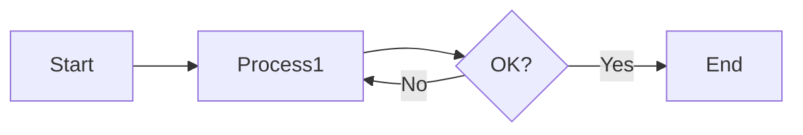

# 🚀 ChainFlow Writer v7 包括的テストスイート

このドキュメントは、v7 で施された PDF 出力エンジンの修正（マージンの一貫性、改ページの安定化、マージン相殺の防止）を極限までテストするためのものです。

## 1. 基本的な文字装飾と構造
通常のテキスト要素が正しくレンダリングされ、適切な行間とフォントが適用されているか確認します。

- **太字 (Bold)**
- *斜体 (Italic)*
- ~~取り消し線 (Strikethrough)~~
- `インラインコード (Inline Code)`
- [リンク (Link)](https://google.com)
- ==ハイライト (Highlight)== ※拡張機能

---

## 2. マージン相殺 (Margin Collapsing) のテスト
改ページ直後の見出しが、マージンに「衝突」せずに適切な余白を保持しているかテストします。

### 見出しとパディングの境界
このセクションの直後に改ページを挿入します。次ページの冒頭の見出しが PDF の上端に張り付いていなければ成功です。

<div style="page-break-before: always;"></div>

## 3. 2ページ目の冒頭 (Page 2 Header)
**[CHECK]** この見出しの上に適切な空間（h2 の margin-top）がありますか？
もし上端に張り付いている場合は、マージン相殺防止策（padding-top: 0.1mm）が機能していません。

### 3.1 ネストされたリストのレンダリング
- レベル 1
    - レベル 2
        - レベル 3
            - レベル 4 (極限のネスト)
- レベル 1 への復帰

---

## 4. 長い表 (Long Table) のページ跨ぎ
表がページを跨ぐ際の挙動を確認します。`break-inside: avoid` が設定されているため、セルの中断が最小限に抑えられているはずです。

| ID | 項目名 | 説明 | 備考 |
| :--- | :--- | :--- | :--- |
| 001 | データ項目 A | 長い説明文のテスト。このセルは十分な長さを持つ必要があります。 | 正常 |
| 002 | データ項目 B | 改ページを誘発するためのダミーデータ行です。 | 正常 |
| 003 | データ項目 C | ページの下端付近に配置されるはずです。 | 要確認 |
| 004 | データ項目 D | **この行が次のページに送られるか、あるいは綺麗に分割されるか？** | 要確認 |
| 005 | データ項目 E | 3ページ目に到達する可能性があります。 | 正常 |

---

## 5. 数式と図表 (KaTeX & Mermaid)
数式の色や Mermaid の背景、改ページ防止が機能しているか確認します。

### 数式ブロック
$$
\phi = \frac{1+\sqrt{5}}{2} \approx 1.618
$$

### Mermaid ダイアグラム


---

## 6. 特殊なコンテナ (Custom Containers)
::: info
**情報ブロック**: マージンやパディングが PDF 出力時に崩れていないか確認してください。
:::

::: warning
**警告ブロック**: 背景色と境界線が正しく出力されている必要があります。
:::

::: stamp right:20mm; width:30mm;
**STAMP TEST**
(画像がある場合はここに表示)
:::

---

## 7. コードブロック
フロントマターの `code_bg: "#2d2d2d"` が背景に適用されているか確認します。

```python
import sys

def test_v7_rendering():
    """
    このコードブロックがページを跨ぐ際、
    崩れずに表示されるかテストします。
    """
    print("PDF Margin Consistency: OK")
    print("Page Break Stability: OK")
    return True
```

---

## 8. 最終チェック
この行が最後のページの下部に位置し、フッター（ページ番号など）と干渉していないか確認してテストを終了します。
