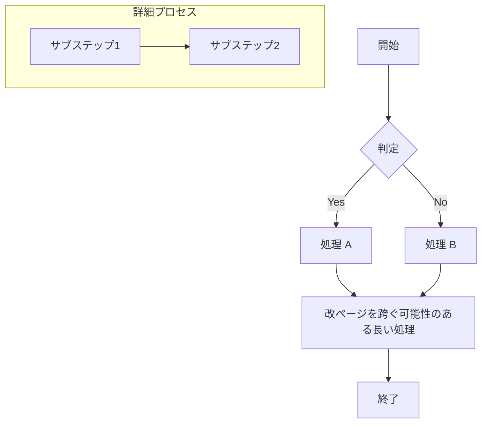
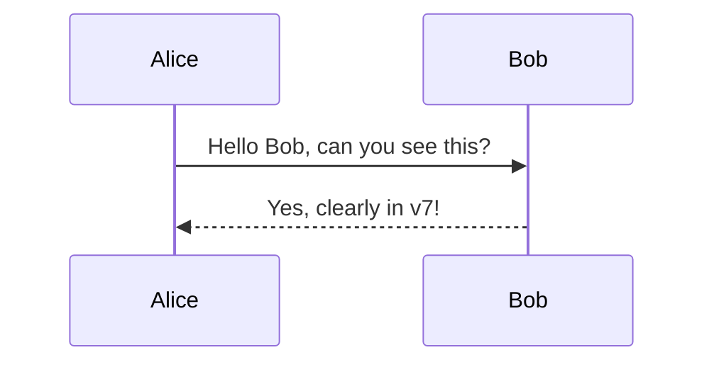

# 🚀 v7 最終・高負荷ストレス試験

このドキュメントは、KaTeX 数式、Mermaid 図表、スタンプ配置、および「フル・フィディリティ方式」によるマージンエミュレーションの究極のテスト用です。

::: stamp right:5mm; margin-top:5mm; width:35mm;

:::

## 1. 高精細な数式レンダリング (KaTeX)
物理マージン 0 の状態で、数式が正しい位置（中央揃え）に配置され、マージンが確保されているか確認します。

$$
\mathcal{L} = -\frac{1}{4}F_{\mu\nu}F^{\mu\nu} + i\bar{\psi}\cancel{D}\psi + y\bar{\psi}\phi\psi + |D_\mu\phi|^2 - V(\phi)
$$

インライン数式 $\sqrt{a^2 + b^2} = c$ も正しく描画されます。

---

## 2. 動的な図表テスト (Mermaid)
複雑なフローチャートがページ境界を跨ぐ際の挙動をテストします。

## 3. 2ページ目冒頭のスタンプと数式
手動改ページ直後の挙動を確認します。ここは 2ページ目（PDF 2枚目）の先頭です。

::: stamp right:5mm; margin-top:5mm; transform: rotate(10deg);

:::

### [CHECK] 上部マージン
この見出しの上の余白が 25mm 正確に確保され、スタンプがその余白領域に綺麗に食い込んでいる（かつ欠けていない）ことを確認してください。

$$
\left( \sum_{k=1}^n a_k b_k \right)^2 \le \left( \sum_{k=1}^n a_k^2 \right) \left( \sum_{k=1}^n b_k^2 \right)
$$

---

## 4. 複雑なネストと描画
HTMLコンテナとスタンプの混在テストです。

<m-d>
### 📦 ネストされたコンテンツ
ここにもスタンプを配置します。

::: stamp left:10mm; margin-top: 0mm; width: 20mm; opacity: 0.6;

:::

::: info
**INFO**: コンテナ内部での絶対配置もプレビューと同じ位置に出力されるべきです。
:::

- **Mermaid in Container**:

</m-d>

---

## 5. 終端の負荷テスト
大量のテキストによる自然な改ページを誘発しつつ、最後にスタンプで締めくくります。

Lorem ipsum dolor sit amet, consectetur adipiscing elit, sed do eiusmod tempor incididunt ut labore et dolore magna aliqua. Ut enim ad minim veniam, quis nostrud exercitation ullamco laboris nisi ut aliquip ex ea commodo consequat. 

(同じ内容を複製...)

::: stamp right:10mm; margin-bottom: 10mm;

:::

**[END OF TEST]**
