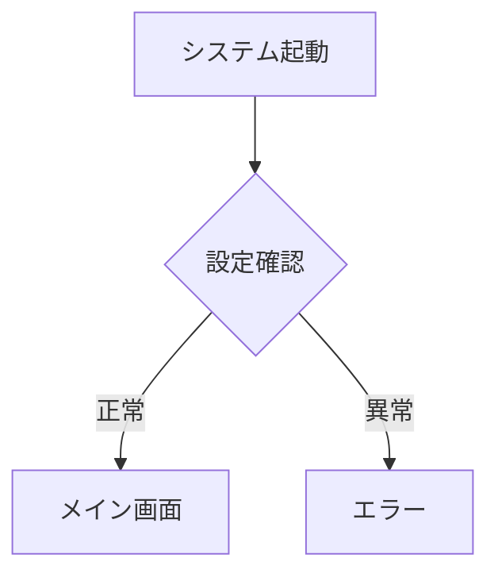
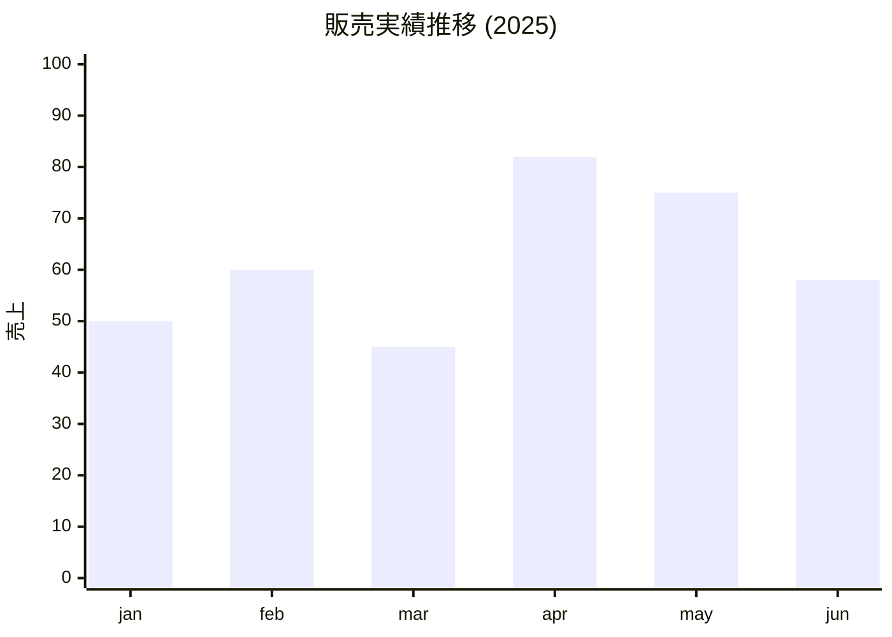
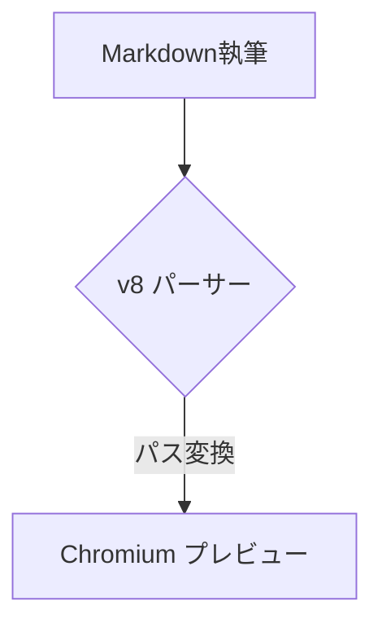

# ChainFlow Writer v8 完全統合ガイドブック ✍️
## 「心地よい Markdown」から「極致の DTP」まで

---

## 1. 概要 (Overview)
**ChainFlow Writer** は、標準的な Markdown 執筆の心地よさをベースに、必要に応じて高度なレイアウト制御（DTP 志向）までをシームレスに拡張できる次世代エディタです。

「シンプルに書き始め、美しく仕上げる」
メモ書きから、図解入りの技術資料、そして印影まで必要な正式な事務報告書まで、この一冊（一つのアプリ）で完結します。

---

## 2. 執筆の 3 Step レベル

### 【Step 1】 ベースは慣れ親しんだ Markdown
特別な知識は不要です。標準的な GitHub Flavored Markdown (GFM) に対応しており、いつもの書き方で即座に執筆を開始できます。
- **リアルタイム A4 プレビュー**: 編集画面に「印刷境界線」を表示。物理的な A4 サイズを意識しながら書けるため、PDF 化した時の「思っていたのと違う」がゼロになります。
- **1:1 PDF Fidelity**: プレビューで見ているものが、そのまま寸分違わず PDF になります。
- **インテリジェント・パス解決**: Windows の絶対パス（`C:\...`）を貼り付けるだけで、プレビューと PDF の両方で画像が即座に表示されます。面倒な `file:///` 記法などは不要です。

### 【Step 2】 必要に応じた図解と数式 (Rich Expression)
標準 Markdown では足りない時、強力なプラグインがあなたを支えます。
- **📈 Mermaid v11**: フローチャート、シーケンス図、マインドマップをテキストだけで描画。
- **📐 KaTeX**: 物理学、数学などの高度な数式を美しくレンダリング。

### 【Step 3】 究極のレイアウト制御 (Power User)
「ここだけは HTML のように自由に配置したい」というプロの要望にも応えます。
- **魔法のタグ `<m-d>`**: HTML の `<div>` 等の中に Markdown を直接書ける独自タグ。
- **CSS 直接指定**: レイアウトや文字装飾を CSS で微調整可能。
- **Stamp Syntax**: ページ上の任意の位置（絶対座標）にロゴや印影を配置。

---

## 3. v8 の主要な進化点：Split View (上下分割エディタ)

ChainFlow Writer v8 では、エディタ画面を上下に分割し、同一ドキュメントの異なる箇所を同時に表示・編集できる **Split View機能** を搭載しました。

- **「見ながら書く」効率化**: 上段のエディタに `<style>` や全体の構成要素を表示させたまま、下段で本文を書き進めるなど、使い分けが自由。
- **完全なリアルタイム同期**: どちらのエディタで入力しても、即座にもう一方とプレビューに反映されます。
- **フォーカス連動**: ショートカット（太字、リスト等）はカーソルがある方のエディタに正確に適用されます。

---

## 4. 機能実践ガイド (Showcase Gallery)

ChainFlow Writerは、標準的なMarkdown記法に加え、報告書やマニュアル作成に便利な**専用の拡張機能**をいくつか備えています。
ここでは、前章の **「3 Step レベル」** に合わせた具体的な使用例を紹介します。

### 【Step 1 実践】 基本的なテキスト装飾と構造化

#### 1. シンプルな装飾
レポート作成において、文字の強調や打ち消しは不可欠です。
* **太字 (Bold)** : `**テキスト**` と書くと **強調** されます。
* *斜体 (Italic)* : `*テキスト*` と書きます。
* ~~打ち消し線~~ : `~~テキスト~~` と書くと取り消し線が引かれます。
* インラインコード: 文章中に `コード片段` を埋め込めます。

#### 2. 箇条書きとチェックリスト
- 項目A
- 項目B
  - 項目B-1 (インデント付き)

1. 手順1
2. 手順2

- [x] 完了したタスク
- [ ] 選択状態の保存もサポートしています。

#### 3. 引用と補足ブロック
> これは引用ブロックです。
> 複数行にまたがる文章をグループ化し、左側にラインを引いて強調します。

単なる引用とは別に、背景色と罫線で際立たせる「アドモニション」もツールバーから挿入可能です。
::: info
**【情報】** 背景に淡い色を敷くことで、本文との差別化を図ります。重要な前提条件などを書くのに適しています。
:::

::: warning
**【注意】** 手順における危険な操作や禁止事項を、読み手に強くアピールします。
:::

#### 4. 美しいテーブル (Clean Style)
データもパイプ (`|`) で表現可能です。「Table Style」プロパティを **Clean** に設定すると、実績表のような見た目になります。

| 成分名 | 含有量 | 備考 |
| :--- | :---: | ---: |
| エタノール | 50% | 溶剤 |
| 香料 | < 10% | 秘密 |

#### 5. 画像サイズ指定と配置
標準で中央揃えやサイズ変更に対応します。
::: center

:::


### 【Step 2 実践】 図解と数式の高度な表現

#### 6. 図解とフローチャート (Mermaid.js)
テキストだけで複雑な図を描画でき、最新の Mermaid v11 エンジンの恩恵を受けられます。


#### 7. 最新の図解機能 (XY Chart)
これまで難しかった XY グラフなどもテキストだけで記述可能です。


#### 8. 数式表現 (KaTeX)
美しい数式のレンダリング。インライン式 `$E=mc^2$` も可能です。
$$
x = \frac{-b \pm \sqrt{b^2 - 4ac}}{2a}
$$


### 【Step 3 実践】 究極のレイアウト制御 (Power User)

#### 9. 配置と文字サイズのコントロール
画面の右寄せや、文字の拡大縮小を自由に配置します。
::: right
これは **「右寄せ (Right Text)」** ブロックです。署名などを配置したい時に適しています。
:::

::: large
**「Large Text」**タイトルページや、特に強調したい注意書きなどに最適です。
:::

#### 10. 高度なHTMLスニペット (2段組み等)
Markdownでは表現が難しい便利なHTML構造を挿入できます。
<div style="display: flex; gap: 20px;">
  <div style="flex: 1; min-width: 0;">
    **【左カラム】** <br>
    ここは左側のコンテンツです。ウィンドウ幅に応じて自動割付されます。
  </div>
  <div style="flex: 1; min-width: 0;">
    **【右カラム】** <br>
    片方に画像、もう片方に説明文、といった高度な構成が可能です。
  </div>
</div>
<div style="clear: both;"></div>

#### 11. PDF出力時の強制改ページと印刷制御
「ここからは次のページから始めたい」箇所に `ページ区切り` を挿入します。
また、**印刷非表示ブロック** も用意されています。
::: no-print
この「no-print」ブロック内の内容は、*エディタ上では見えますが、PDF出力時には自動的に完全に削除されます。*
:::

#### 12. 電子印影・スタンプ機能
`::: stamp` ブロックを使用すると、絶対座標に画像を配置できます。標準で「乗算」ブレンドがかかるため、紙に押したようなリアルな質感を再現します。
::: center
::: stamp right:30mm; margin-top:-20mm; transform:rotate(-10deg); opacity:0.8;

:::
*↑文字の上に重なる「認め印」や「社外秘スタンプ」の表現。*
:::

#### 13. 変数埋め込みとインタラクティブ・スニペット
文書冒頭で定義した値を `{{変数名}}` として参照したり、クリックで定型文をコピーできる機能を配置してチームの転記ミスを防ぎます。

#### 14. Webデザインの直接取り込み (Sniper連携)
ChainFlow エコシステムの **Sniper Research Shell** (Sモード) を使用することで、Web上の美しい情報ボックス、箇条書き、リスト、表などの実用的なデザインをそのままWriterへ取り込むことができます。
Sniperによって抽出された要素は「超軽量化されたポータブルなHTML」に最適化されているため、コピー＆ペーストによるレイアウト崩れや無駄なCSSの混入を防ぎ、A4紙面に完璧にフィットするデザインブロックとして即座に再利用可能です。

---

## 5. 究極のキーボード・ワークフロー (ショートカット一覧)

v8 ではマウスを握ることなく、すべての操作をキーボードで完結可能です。

| カテゴリ | コマンド | キー操作 |
| :--- | :--- | :--- |
| **ファイル** | 保存 / 名前を付けて保存 | `Ctrl + S` / `Ctrl + Shift + S` |
| | PDF 出力 | `Ctrl + P` |
| **表示** | **集中モード (Focus Mode)** | `F11` |
| | エディタの表示切替 | `Ctrl + Alt + B` |
| | **上下エディタ間のフォーカス切替 (v8)** | `Ctrl + Tab` |
| **構造/装飾** | 太字 / 斜体 | `Ctrl + B` / `Ctrl + I` |
| | 見出し / リスト | `Ctrl + 1〜3` / `Ctrl + Shift + 8/9` |
| | 強制改ページ | `Ctrl + Shift + Enter` |
| **拡張機能** | スニペットギャラリー | `Ctrl + Q` |
| | `<m-d>` タグ / スタンプ挿入 | `Ctrl + Shift + D` / `Ctrl + Shift + T` |

---

## 6. プロパティとレイアウト設定 (Property Panel)

右側の設定ペインで、ドキュメントの「器」を直感的に調整できます。
- **用紙サイズ / タイポグラフィ**: A4/B5 等のサイズやフォント微調整。
- **枠線設定**: テーブルの枠線有無をワンクリック切替。
- **ページ装飾**: ヘッダー・フッターやページ番号の自動挿入。

---

## 7. インストール・環境設定

### 環境準備
Python 3.12 以上が必要です。
```powershell
py -m pip install PySide6 markdown2 pygments python-frontmatter PyYAML
```

### 起動方法
```powershell
py main.py
```

---

## 8. ディレクトリ構成とポータビリティ

- `app/`: コアロジック (UI, Widget, Utils)
- `snippets_data/`: 登録済みスニペットと設定データ。
  - すべての設定がこのフォルダに集約されているため、フォルダごと持ち運ぶだけでどこでも同じ環境が再現されます。

---
---

## 9. 付録：テクニカル検証と統合テスト (Technical Verification)

# 🚀 ChainFlow Writer v8 統合テスト用ドキュメント
以降は、v8で実装された新機能（パス自動解決など）と既存のレンダリングが正常に動作するかを網羅的に確認するためのテスト用セクションです。必要に応じてプレビュー結果と突き合わせてください。

### 1. 【新機能】スタンプ & パス自動解決テスト
v8の目玉機能である、Windowsパスと相対パスの自動正規化をテストします。
::: stamp width:15mm;

:::
> **[Check 1]** 右上に絶対パス指定の画像が表示されていますか？

### 2. 魔法のタグ `<m-d>` テスト
<div style="background: #fdf6e3; padding: 20px; border-radius: 8px;">
<m-d>
- **太字** や *斜体*
- `code line`
</m-d>
</div>

### 3. 数式 (KaTeX) & ダイアグラム (Mermaid) パーサー連動
$$
e^{i\pi} + 1 = 0
$$



### 4. 既存コンテナ & コードブロック
::: info
**v8 Update:** 情報ブロックの生成プロセステスト。
:::

```python
def v8_feature_test():
    path = r"C:\Users\T03000\Desktop\rect1.png"
    return path
```

### 5. テーブルレンダリングテスト
| 機能名 | 状況 | 備考 |
|:---|:---:|:---|
| Path解決 | ✅ | v8 新規 |
| Stamp | ✅ | CSS改善済み |

<div style="page-break-before: always;"></div>
※ここで改ページが行われれば正常です。

---
*ChainFlow Writer v8 - 執筆を、もっと美しく、もっと自由に。*
